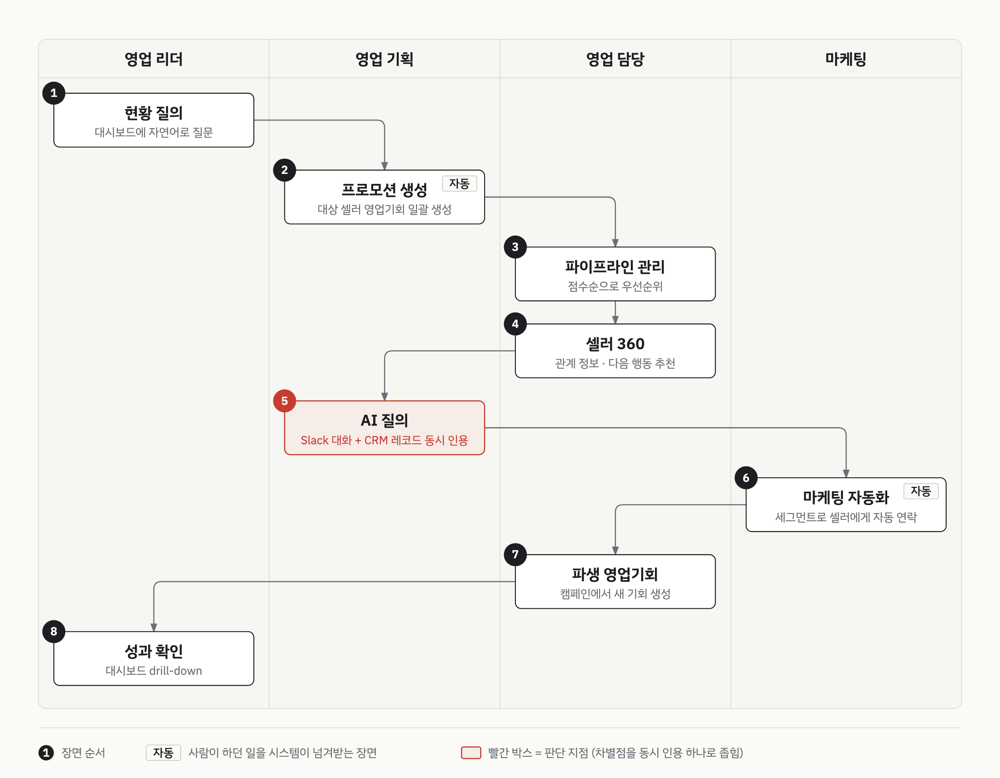

# 커머스 플랫폼 셀러 영업 AI 데모

> 고객사 보안상 고객사명과 데모 자료는 공개하지 않습니다. 시나리오 구조와 설계 판단만 정리합니다.

| 항목 | 내용 |
|:--|:--|
| 구분 | 데모 (프리세일즈) |
| 기간 | 2026.08 ~ 2026.09 |
| 역할 | 설계·데모 org 구축 |
| 제품 | Tableau Next, Agentforce, Slack, Marketing Cloud Engagement, Data Cloud, Sales Cloud |
| 상태 | 발표까지 (2026.09) |

## 맥락

플랫폼에 입점한 셀러를 상대로 영업하는 조직입니다. 이 조직은 파이프라인·프로모션·셀러 관계 정보를 한 화면에서 보지 못했습니다.

일하는 사람은 도식의 네 레인과 같습니다. 영업 리더는 현황과 성과를 봅니다. 영업 기획은 프로모션 대상을 고르고 AI에 묻습니다. 영업 담당은 셀러를 만나 영업기회를 진행합니다. 마케팅은 셀러에게 연락을 보냅니다.

고객이 처음 준 답변에서 관리 대상 1순위는 입점 셀러였습니다. 같은 칸에 신규 영업과 기존 셀러 업셀·협업이 함께 적혀 있었습니다.

## 제약

- 데모 org에서 발표(2026.09)까지 시연한 범위입니다.
- 레코드와 연결된 Slack 채널은 외부 포털 사용자 라이선스를 지원하지 않습니다. 그래서 외부 셀러는 Slack 장면에 넣지 않고, Slack은 내부 협업 자리로만 썼습니다.
- Slack에는 과거 시점 메시지를 심을 수 없습니다. 그래서 과거 맥락(전임 담당자의 인수인계 메모 등)은 타임스탬프가 아니라 본문 내용으로 만든다는 규칙을 세웠습니다.

## 프로세스 흐름

여덟 장면을 역할별 레인에 놓았습니다. 빨간 박스는 데모의 차별점을 하나로 좁힌 자리입니다.

## 단계별 워크스루

장면마다 Slack에 둘지 CRM에 둘지를 한 기준으로 갈랐습니다. 이미 Slack에서 일하는 사람이 CRM으로 넘어가지 않고 Slack에서 일을 끝내게 합니다. **다만 옮기면 약해지는 순간은 옮기지 않았습니다.**

### ① 현황 질의

- 데모에서 보여준 것: 영업 리더가 대시보드에서 목표 대비 부족한 파이프라인을 봅니다. Slack에서 파이프라인을 묻고, 그 답을 근거로 팀 채널에 업무를 지시합니다.
- 쓴 기능: Tableau Next, Data Cloud, Slack
- 판단: 대시보드를 본 그 자리에서 묻고 지시하도록 Slack으로 옮겼습니다. "아침에 자동으로 떴습니다"라는 문장은 대본에 넣지 않았습니다. Tableau Next 대시보드에는 자동 게시 스케줄이 없어서 미리 공유해 둡니다.
- 상태: 시연

### ② 프로모션 생성

- 고객 현재: 대상 셀러를 사람이 골라 목록으로 정리했습니다.
- 데모에서 보여준 것: 영업 기획이 리스트뷰에서 조건으로 대상 셀러를 거릅니다. 버튼 하나로 고른 셀러의 성장 프로그램 영업기회를 한 번에 만듭니다.
- 쓴 기능: Sales Cloud 리스트뷰, Screen Flow
- 판단: 다중 조건 필터는 CRM에 남겼습니다. Slack에 그런 화면이 없어서 리스트뷰에 뒀습니다.
- 상태: 시연

### ③ 파이프라인 관리

- 데모에서 보여준 것: 영업 담당이 홈 대시보드와 칸반에서 내 영업기회를 봅니다. 점수순으로 정렬해 먼저 연락할 셀러를 고릅니다.
- 쓴 기능: Sales Cloud 대시보드·칸반, Einstein Opportunity Scoring
- 판단: 칸반 탐색은 CRM에 남겼습니다. 둘러보는 감각이 이 장면의 힘이라 옮기지 않았습니다. 칸반에는 여러 영업 흐름이 보이지만, 처음부터 끝까지 보여준 것은 성장 프로그램과 교차 판매 두 흐름입니다. 여러 셀러를 묶는 공동 프로모션의 영업기회 유형도 지우지 않았습니다. 칸반에서 열이 비면 오히려 눈에 띄고, 유형과 캠페인이 이미 org에 있어 남기는 비용이 거의 없었습니다.
- 상태: 시연

### ④ 셀러 360

- 고객 현재: 셀러의 진척과 이력이 여러 문서·시트에 흩어져 있었습니다.
- 데모에서 보여준 것: 영업 담당이 AI 요약으로 전임 담당자 때의 이력을 읽고, 다음 행동 추천으로 연락 방법을 받습니다. 미팅 내용을 Slack에서 정리하고 영업기회 채널에서 기획 담당을 부릅니다. 같은 화면에서 사용자를 바꿔 관계 메모가 가려지는 것을 보여줍니다.
- 쓴 기능: Agentforce, Next Best Action, 필드 단위 권한, Slack
- 판단: **관계 정보와 권한 통제를 한 화면에 보여줬습니다.** 셀러와의 비공식 관계나 미팅 메모 같은 민감 정보를 별도 오브젝트에 모았습니다. 필드 단위 권한으로 사람마다 일부만 가려 보이게 해서, 정보를 모으는 것과 통제하는 것을 한 장면에 담았습니다. 추가로 들어온 관계 정보와 접근 권한 요구도 새 장면 없이 이 장면에 흡수했습니다.
  기각한 대안: 두 요구를 별도 장면으로 나누는 안. 따로 보여주면 민감 정보는 우려만 남기고, 권한 통제는 설정 화면 시연에 그칩니다.
- 판단: 미팅 정리와 동료 호출은 Slack으로 옮겼습니다.
- 상태: 시연

### ⑤ AI 질의

- 고객 현재: 대화 기록과 영업 데이터를 따로 뒤져 맞춰 봤습니다.
- 데모에서 보여준 것: 영업 기획이 성과 리포트를 본 뒤 AI에 묻습니다. 답 하나에 Slack 대화와 CRM 레코드가 함께 인용됩니다. 답을 스레드에 공유하고 마케팅 담당을 부릅니다.
- 쓴 기능: Agentforce, Slack, Sales Cloud 리포트
- 판단: **"자연어 질의" 자체는 팔지 않았습니다.** 자연어로 데이터를 묻는 기능은 이미 흔해서 그것만으로는 차별점이 되지 않았습니다. 차별점을 "Slack 대화와 CRM 레코드를 동시에 인용한다"로 좁혔습니다. 도식의 빨간 박스가 이 자리입니다.
- 판단: "AI가 과거 대화를 알아서 참고합니다"라는 문장은 대본에 넣지 않았습니다. AI는 채널을 자동으로 읽지 않습니다. 질문할 때 채널 내용을 명시적으로 끌어옵니다.
- 상태: 시연

### ⑥ 마케팅 자동화

- 고객 현재: 담당자가 셀러에게 개별로 연락했습니다.
- 데모에서 보여준 것: 마케팅이 세그먼트 조건으로 연락할 셀러를 고르고 메시징 채널로 자동 발송합니다.
- 쓴 기능: Marketing Cloud Engagement, Data Cloud
- 판단: 발표 현장에서 세그먼트를 즉석 발행하지 않았습니다. 발행에 수 분 이상 걸리므로 미리 발행하고 결과 화면을 고정해 뒀습니다.
- 상태: 시연

### ⑦ 파생 영업기회

- 데모에서 보여준 것: 영업 담당이 캠페인 반응에서 생긴 교차 판매 영업기회를 이어, 버튼으로 파트너 영업기회까지 만듭니다. 셀러 계정 한 화면에 유형이 다른 영업기회가 모입니다.
- 쓴 기능: Sales Cloud (Account RecordType), Flow
- 판단: 관련 목록 한 장이 결론인 장면이라 CRM에 뒀습니다. 추가로 들어온 파트너사 관리 요구도 이 장면에 흡수해, 셀러 계정 화면의 관련 목록 한 장으로 끝냈습니다. 여러 셀러를 한 프로모션으로 묶는 구조가 아니라, 한 파트너가 여러 팀과 붙는 구조라서 이 장면과 모양이 같았습니다.
- 상태: 시연

### ⑧ 성과 확인

- 데모에서 보여준 것: 영업 리더가 활동 리포트를 보고 대시보드를 drill-down합니다. AI에 마무리 질문을 던집니다.
- 쓴 기능: Sales Cloud 리포트·대시보드, Agentforce, Slack
- 판단: 활동을 돌아보고 마무리 질문을 던지는 순간은 Slack으로 옮겼습니다. drill-down은 본앱에서 합니다. Slack에 공유한 카드는 스냅샷이라, "Slack 안에서 다 파고들 수 있습니다"라는 문장은 대본에 넣지 않았습니다.
- 상태: 시연

## 데모 설계 과정

- 2026.08: 요구를 듣고 첫 시나리오를 세웠습니다. 신규 셀러 입점을 앞에 둔 흐름이었고, 그대로 org 구축을 시작했습니다.
- 2026.08: 고객 피드백으로 시나리오가 뒤집혔습니다. 신규 입점보다 기존 셀러를 키우는 흐름이 현업에 맞았습니다.
- 2026.08 ~ 09: 기존 셀러의 성장 프로그램을 중심에 두고 여덟 장면으로 다시 짰습니다. 시나리오보다 기능 목록을 먼저 확정했습니다.
- 2026.09: 최종 발표를 했습니다.

### 가설과 뒤집힘

첫 시나리오는 제품사 측이 세웠고, 저는 그 시나리오로 org 구축을 시작했습니다. 미입점 브랜드를 찾아 입점 계약까지 가는 영입 흐름이었습니다. 저는 이 흐름에 맞춰 온보딩·정산 화면과 셀러 포털까지 세웠습니다.

고객 싱크에서 두 가지가 뒤집혔습니다. 현업이 가장 많이 하는 일은 영입이 아니라 기존 셀러를 키우는 프로그램 운영이었습니다. 셀러 포털은 이번 발표 범위에서 빠졌습니다.

처음 받은 답변과 첫 시나리오는 어긋나 있었습니다. 답변은 기존 셀러 업셀을 1순위 칸에 적었고, 첫 시나리오는 신규 입점을 앞에 뒀습니다.

재설계한 시나리오는 성장 프로그램을 중심에 두고, 영업 기획·영업기회·영업 성과의 세 단계로 프로그램을 따라갑니다. 뒤이은 고객 싱크에서 지표와 추가 요구가 나왔습니다. 추가 요구는 파트너사 관리, 영업 담당이 쌓는 비공식 관계 정보, 개인정보 접근 권한이었습니다.

### 소통·검증

- org를 확인하다 Slack 사용자 매핑이 안 된 것을 찾아 보고했습니다. 제품사 측이 연결을 다시 했습니다.
- 기능 문서와 실측이 다른 곳을 직접 쟀습니다. 문서가 특정 태블릿에서만 된다고 한 대면 미팅 전사가 휴대폰에서도 동작했습니다. 한국어 고유명사는 전사 품질이 낮다는 것도 같이 확인했습니다.
- 기능 확정표를 org 실측으로 다시 맞췄습니다. 표에 비어 있다고 적힌 자산이 org엔 이미 여럿 있었습니다. 반대로 데모 org의 기본 샘플 데이터가 담당자 화면에 섞여 들어가는 자리처럼, 데이터가 틀리게 보이는 곳을 찾았습니다.
- 데이터가 흐르다 끊기는 자리를 찾았습니다. 활동 데이터는 Data Cloud에 적재됐지만 모델링이 안 돼 대시보드와 AI가 읽지 못했습니다. **막힌 곳은 적재가 아니라 모델링이었습니다.** 셀러 거래액을 담을 자리도 CRM에 없었습니다.

### 범위를 지킨 기준

시나리오와 따로 기능 목록부터 확정했습니다. 그다음 들어오는 요구는 이 세 질문으로 걸렀습니다.

1. 데모의 영업 흐름 중 어디에 붙는가. 어디에도 안 붙으면 이번 데모 밖입니다.
2. 새 오브젝트가 필요한가, 기존 필드로 되는가. 필드로 되면 필드로 갑니다.
3. 새 장면인가, 기존 장면의 한 줄인가. 장면 수는 고정하고 줄만 늘립니다.

이 기준으로 추가 요구를 새 장면 없이 기존 장면에 흡수했습니다. 어느 장면에 넣었는지는 ④와 ⑦에 적었습니다.

### 만들지 않은 것과 뺀 것

- 영입 흐름용 온보딩·정산 화면과 셀러 포털은 만든 뒤 시나리오에서 뺐습니다. 버리지는 않고 발표의 이후 단계 구성에 남겼습니다.
- 여러 셀러를 묶는 공동 프로모션은 발표의 비전 장표로만 뒀고 새로 구현하지 않았습니다.
- 대면 미팅 실시간 전사는 시나리오 필수 경로에서 뺐습니다. 장면 문장이 "통화 내용을 붙여 넣는다"여서 미리 준비한 텍스트로 충분했고, 전사 품질 위험을 무대에 올리지 않았습니다.

## 데이터 모델 (개념)

**셀러와 파트너를 표준 Account 하나에 담았습니다.** RecordType으로 셀러와 파트너를 나누고, 화면은 유형별로 다르게 그렸습니다. 쪼개지 않은 이유는 「재사용 원칙」에 적었습니다.

영업기회는 영업 흐름마다 RecordType을 나눴습니다. 흐름이 여러 갈래여도 별도 오브젝트를 만들지 않고 하나의 파이프라인에서 보게 했습니다.

프로그램 참여는 별도 개념으로 뒀습니다. 성장률 같은 참여 결과가 여기에 붙습니다. 모든 참여가 영업기회로 이어지지는 않아서 영업기회와는 선택적으로만 연결했습니다.

캠페인 연결은 세 갈래를 한 세트로 채웠습니다. 영업기회의 기본 캠페인, 캠페인·셀러·영업기회를 잇는 참여 기록, 캠페인 멤버입니다. 하나만 채우면 화면 어딘가가 빕니다.

관계 메모는 별도 개념으로 분리했습니다. 권한 장면을 위한 분리이며, 그 판단은 ④에 적었습니다.

한 파트너가 여러 팀과 동시에 일하는 구조는 협업 프로젝트와 참여자라는 두 개념으로 풀었습니다. 계정 사이 관계나 영업기회만으로는 여러 팀이 얽힌 모양을 담지 못합니다.

셀러 거래액은 CRM 필드에 넣지 않았습니다. 영업기회 금액은 계약 금액이지 셀러 거래액이 아닙니다. 월별 셀러 실적 같은 시계열은 Data Cloud에 따로 적재해 대시보드가 읽게 했습니다.

## 발표 설계

이 절은 발표 설계입니다. 인물별 변화는 실제 업무에서 확인한 pain point가 아니라, 데모 서사를 짠 방식입니다.

발표 순서는 고객이 받아들이는 as-is가 정했습니다. 고객이 이해하고 있는 현재 모습을 먼저 정리하고, 그 이해를 바탕으로 데모를 보여준 뒤, 도입 방법과 다른 기업의 도입 사례를 거쳐 단계별 도입 구성으로 마무리했습니다. 고객이 먼저 꺼낸 걱정을 풀고 나서 단계별로 설득하는 순서입니다.

문제 정의는 한 줄로 잡았습니다. 셀러·파트너 정보가 흩어져 있고 표준 프로세스가 없어 업무 자동화가 안 된다는 것, 그래서 통합 플랫폼 위에 AI·자동화·인사이트를 얹는다는 것입니다.

인물은 영업 리더, 영업 담당, 마케팅을 앞에 세웠습니다. 인물마다 "기존과 비교해 어떤 일을 안 하게 되는가"로 변화를 말했습니다.

단계 구성의 첫 자리에는 데이터를 쌓는 기반을 놓았습니다. AI로 키우려면 기반이 먼저라는 것이 배치 근거입니다. 영입 흐름에서 뺀 기능도 이후 단계에 남겼습니다.

## 결과

- 셀러 360 한 화면에서 관계 정보와 다음 행동 추천을 보여줬습니다.
- 조건으로 고른 셀러의 영업기회를 한 번에 만들었습니다.
- AI 질의 한 번에 Slack 대화와 CRM 레코드를 함께 인용했습니다.
- 세그먼트 조건으로 셀러에게 자동 연락했습니다.

## 재사용 원칙

다른 프리세일즈에도 그대로 가져가는 판단 기준입니다.

- **차별점은 하나로 좁힙니다.** 흔해진 기능은 팔지 않고, 다른 도구가 못 하는 한 가지를 앞에 둡니다.
- 민감 정보 기능은 권한 통제와 같은 장면에서 보여줍니다.
- 셀러 360은 오브젝트를 쪼개지 않고 표준 Account의 RecordType으로 나눕니다. 이 데모에서는 셀러와 파트너가 한 오브젝트에 있어, 계정 한 화면에 유형이 다른 영업기회가 모였습니다(장면 7).
- 하이라이트 패널은 RecordType별 Compact Layout으로 가릅니다. 하이라이트에 그려지는 필드는 App Builder가 아니라 Compact Layout이 정합니다. 셀러와 파트너의 하이라이트를 이렇게 나눴습니다.
- 데이터가 거의 없는 유형의 관련 목록은 레이아웃에서 빼지 않고 조건부 표시로 숨깁니다. 빈 카드는 데모에서 미완성으로 읽힙니다.
- 권한 차등은 Profile을 늘리지 않고 Permission Set으로 합니다. 민감 필드용 Permission Set 하나의 유무로 관계 메모가 가려지는 장면(장면 4)을 만들었습니다.

## 적용한 개념

구현에 쓰인 자료구조·알고리즘 개념입니다.

- **다대다 그래프 (교차 레코드)** — 캠페인과 셀러, 협업 프로젝트와 파트너를 각각 양쪽 부모를 가진 교차 레코드로 이었습니다. 한 셀러가 여러 캠페인에, 한 파트너가 여러 팀 협업에 동시에 붙는 모양은 한쪽 Lookup으로 담지 못합니다.
- **해시 맵 집계** — 담당자에게 쌓인 관계 기록을 최신순으로 한 번 훑으며 분류별 건수와 최근 기록일을 맵에 모았습니다. 분류마다 따로 조회하지 않고 한 번의 순회로 레이더와 타임라인을 함께 그립니다.
- **일괄 처리** — 영업 기획이 고른 셀러들을 Flow가 순회하며 영업기회와 캠페인 참여 기록을 컬렉션에 모은 뒤 한 번에 생성합니다. 반복 안에서 한 건씩 저장하면 트랜잭션 한도에 걸립니다.

## 이 문서에 없는 것

- 고객사명, 참석자, 발표 일정과 장소를 뺐습니다.
- 고객 데이터 규모, 거래 수치, 데모 데이터 값을 뺐습니다.
- 고객이 쓰는 내부 도구의 이름과 고객 반응 원문을 뺐습니다.
- 프로그램·캠페인·대시보드의 실제 이름, 데모 인물 이름, 커스텀 필드·오브젝트 API명을 뺐습니다. 고객 미팅 발언은 원문 대신 일반화했습니다.
- 실제 화면 캡처 대신 일반 레이블로 다시 그린 도식만 넣었습니다.
