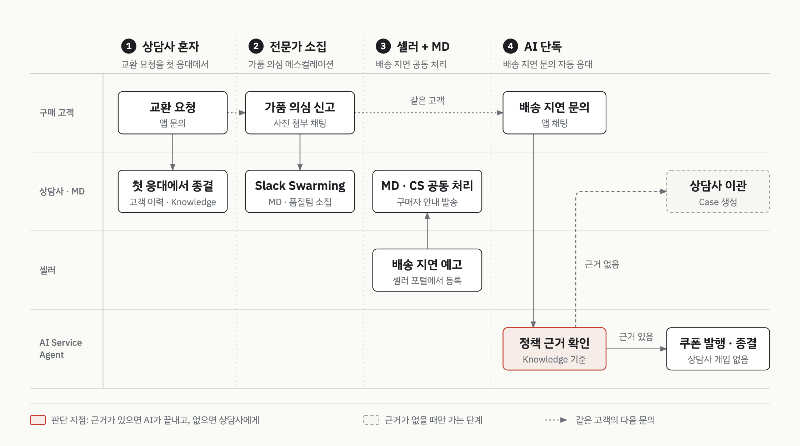

# 패션 마켓플레이스 CS·셀러·AI 통합 데모

> 가상 브랜드 "레이블 라운지"를 배경으로 만든 표준 데모 환경입니다.

| 항목 | 내용 |
|:--|:--|
| 구분 | 데모 (특정 고객사 없는 표준 데모) |
| 기간 | 2026.03 ~ 2026.05 |
| 역할 | 설계·데모 org 구축 |
| 제품 | Service Cloud, Experience Cloud, Agentforce, Slack, Prompt Builder, Knowledge |
| 상태 | 데모 구축 완료 (네 시나리오 모두 구현) |

## 맥락

패션 마켓플레이스는 구매 고객, CS, 셀러가 한 건의 문의에 함께 얽힙니다. 이 데모는 그 구조를 가진 가상 브랜드를 세우고, 한 고객의 구매 여정으로 네 장면을 이었습니다.

네 장면은 누가 결정하느냐로 나뉩니다. 상담사 혼자 끝내는 건, 전문가를 불러야 하는 건, 셀러와 함께 풀어야 하는 건, 사람이 보지 않아도 되는 건입니다.

아래 단계의 "가상 브랜드 현재" 줄은 실제 고객사가 아니라 데모 시나리오에 설정한 출발점입니다. 가상 브랜드는 메신저·앱·웹·전화로 들어오는 문의를 채널별로 따로 대응했고, 셀러와 CS 사이 소통은 끊겨 있었습니다.

## 제약

- 특정 고객사 없이 여러 제안에 쓰는 표준 데모입니다. 핵심 장면 중심으로 빠르게 만들었습니다.
- 데모 org의 기본 설정 위에 얹는 구조입니다.
- 외부 시스템 연동은 실제로 붙이지 않았습니다. Mock endpoint와 발표 멘트로 범위를 고정했습니다. 데모에서 보여줄 것과 설명으로 넘길 것을 먼저 나눈 결과입니다.

## 프로세스 흐름

장면이 넘어갈수록 결정 주체가 상담사 혼자에서 AI Service Agent 단독으로 넓어집니다. 빨간 테두리가 사람과 AI의 경계입니다.

## 단계별 워크스루

### ① 상담사 혼자

- 가상 브랜드 현재: 채널마다 문의를 따로 받았습니다.
- 데모에서 보여준 것: 고객이 앱으로 교환을 요청합니다. 문의는 상담사에게 자동 배정되고, 어느 채널로 들어온 문의든 같은 상담 화면에서 받습니다. 상담사가 케이스를 열면 고객 등급·구매 이력·이전 상담 이력이 바로 보입니다. Knowledge가 교환 정책을 추천하고, 상담사는 그 정책에 맞춰 답변을 보냅니다. 대화는 AI 요약으로 남기고, 상담사가 첫 응대에서 케이스를 종결합니다.
- 쓴 기능: Service Cloud 상담 화면, Knowledge 추천
- 상태: 데모 구축 완료

### ② 전문가 소집

- 가상 브랜드 현재: 상담사 혼자 판단할 수 없는 건도 상담사가 떠안았습니다.
- 데모에서 보여준 것: 고객이 사진을 첨부해 가품 의심을 신고합니다. 가품 여부는 상담사가 단독으로 판단할 수 없습니다. 상담사는 대화를 AI로 요약해 상위 상담사에게 넘깁니다. 상위 상담사가 Slack에서 담당 MD와 품질팀을 부르고, 이들이 Slack에서 결론을 냅니다. 협의 내용은 Case에 남고, 상담사가 결과를 고객에게 안내한 뒤 종결합니다.
- 쓴 기능: Slack Swarming (표준 기능 그대로)
- 상태: 데모 구축 완료. 데모 org에서는 Swarming의 전문가 초대가 대상자의 접속 상태에 묶여, 전문가를 Slack 채널에서 직접 불렀습니다.

### ③ 셀러 + MD

- 가상 브랜드 현재: 셀러와 CS 사이 소통이 끊겨 있었습니다.
- 데모에서 보여준 것: 셀러가 포털에서 배송 지연 예고를 등록합니다. 원인·영향 상품·예상 지연 기간을 말하면 AI가 항목을 모으고, 요약을 확인받은 뒤 케이스를 만들어 담당 MD와 CS 매니저에게 배정합니다. CS 매니저는 영향 받는 구매자를 조회하고, Knowledge로 등급별 보상 기준을 확인합니다. MD와 CS 매니저가 케이스 안에서 대응을 협의하면 AI가 구매자 안내 초안을 씁니다. CS 매니저가 검토해 구매자에게 한 번에 발송합니다.
- 쓴 기능: Experience Cloud 셀러 포털, AI 대화 화면의 표준 선택 카드
- 판단: **셀러가 케이스를 직접 만들지 않게 했습니다.** MD 한 명이 셀러 여럿을 맡습니다. 셀러가 케이스를 직접 만들면 MD가 받는 목록이 셀러 문의 전체가 됩니다. 그래서 AI가 항목을 모아 요약 확인을 받은 뒤에만 케이스를 만듭니다. 포털에는 셀러마다 권한에 맞는 데이터만 보이게 했습니다.
  같은 장면에서 셀러 상품 선택용 LWC를 따로 만들었다가 지우고, AI 대화 화면의 표준 선택 카드로 대체했습니다. 같은 동작을 표준 기능이 하면 커스텀 코드를 남기지 않습니다.
- 상태: 데모 구축 완료. 2026.05에 안내 유형과 대상 등급을 고르는 입력 화면을 보강했습니다.

### ④ AI 단독

- 가상 브랜드 현재: 배송 지연 문의도 상담사가 응대했습니다.
- 데모에서 보여준 것: 고객이 앱 채팅으로 배송 지연을 묻습니다. AI Service Agent가 주문 이력을 조회하고, Knowledge로 배송 지연 정책을 확인합니다. 근거가 있으면 VIP 보상 기준에 따라 쿠폰을 제안하고, 고객이 수락하면 쿠폰을 발행하고 케이스를 종결합니다. 근거가 없으면 Case를 만들어 상담사에게 넘깁니다.
- 쓴 기능: AI Service Agent, Knowledge
- 판단: **AI Service Agent가 쿠폰 발행까지 직접 하게 했습니다.** 대신 답할 근거가 Knowledge에 없으면 그 자리에서 상담사에게 넘깁니다. 자동화의 경계를 사람의 확인이 아니라 정책 근거가 있는지에 뒀습니다.
  기각한 대안: 발행 전에 상담사가 승인하는 단계.
- 상태: 데모 구축 완료

## 결과

검증된 것:

- 네 장면을 데모 org에 모두 구현했습니다 (2026.04).
- 장면 ③의 안내 입력 화면을 보강했습니다 (2026.05).

아직 열린 질문:

- 주문·배송·쿠폰 적립을 실제 외부 시스템과 연동하지 않았습니다. 쿠폰은 레코드 생성까지만 합니다.
- 메신저 채널은 실제 연동 없이 모의 화면으로 구성했습니다.
- Swarming의 전문가 초대가 데모 org 밖에서 표준 동작대로 도는지는 확인하지 않았습니다.

## 재사용 원칙

다른 고객 제안에도 그대로 가져가는 판단 기준입니다.

- **자동화의 경계는 승인 단계가 아니라 근거의 유무로 긋습니다.** 근거가 있는 응대는 사람이 봐도 같은 답이 나옵니다.
- 같은 동작을 표준 기능이 하면 커스텀 코드를 남기지 않습니다.
- 데모에서 보여줄 것과 설명으로 넘길 것을 먼저 나눕니다.

## 이 문서에 없는 것

- 등장 브랜드·인물·데이터는 전부 가상입니다.
- 제안 대상 고객사와 영업 관련 수치를 뺐습니다.
- 소스 코드, 필드 API명, 데모 org 정보를 뺐습니다.
- 실제 화면 캡처 대신 일반 레이블로 다시 그린 도식만 넣었습니다.
