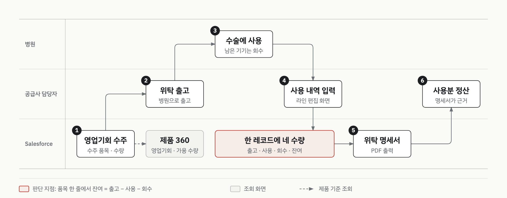

# 의료기기 유통 위탁 재고·사용 내역 관리 데모

> 고객사 보안상 고객사명과 데모 자료는 공개하지 않습니다.

| 항목 | 내용 |
|:--|:--|
| 구분 | 데모 (프리세일즈) |
| 기간 | 2026.03 |
| 역할 | 데모 org 구축 |
| 제품 | Sales Cloud, LWC, Apex, Visualforce |
| 상태 | 데모 구축 완료 (2026.03) |

## 맥락

의료기기를 병원에 먼저 맡겨 두고(위탁), 실제 수술에 쓴 만큼 정산하는 유통 구조입니다.
어느 병원에 얼마가 나가 있고, 얼마를 썼고, 얼마를 회수해야 하는지를 한 흐름으로 봐야 합니다.

## 제약

- 데모 이전의 업무 방식과 고객 요구는 기록이 남아 있지 않습니다.
- 그래서 아래 단계는 데모 org에 구현된 코드에서 확인한 내용만 적었습니다.

## 프로세스 흐름

빨간 테두리가 흐름의 중심입니다. 사용 내역 입력이 이 레코드에 쓰고, 위탁 명세서가 같은 레코드를 읽습니다.

## 단계별 워크스루

### ① 영업기회 수주

- 데모에서 보여준 것: 수주한 품목과 수량이 영업기회에 남습니다. 제품 360 화면에서는 제품 하나를 기준으로 가용 수량과 나가 있는 수량, 어느 영업기회에 나가 있는지, 가격과 구성품을 함께 봅니다.
- 쓴 기능: 영업기회 수주 품목, 제품 360 화면(LWC)
- 구성의 특징: 위탁 품목은 이 영업기회의 수주 품목에서 불러옵니다. 위탁 건에 영업기회가 연결돼 있어야 품목이 나타납니다.
- 상태: 데모 구축 완료

### ② 위탁 출고

- 데모에서 보여준 것: 공급사 담당자가 병원으로 내보낸 수량을 라인 편집 화면의 출고 칸에 적습니다.
- 상태: 데모 구축 완료

### ③ 수술에 사용

- 데모에서 보여준 것: 병원에서 수술에 쓴 수량과 회수한 수량이 ④에서 사용·회수 칸으로 들어갑니다.
- 구성의 특징: 데모 코드에 병원이 직접 입력하는 화면은 없습니다. 기록은 공급사 담당자가 합니다.
- 상태: 데모 구축 완료

### ④ 사용 내역 입력

- 데모에서 보여준 것: 라인 편집 화면에서 품목마다 한 줄로 출고·사용·회수를 입력합니다. 품목명·코드·단가·수주 수량이 같은 줄에 함께 보입니다.
- 쓴 기능: 라인 편집 화면(LWC), 저장 처리(Apex)
- 구성의 특징: 수주 수량은 읽기 전용입니다. 출고·사용·회수를 입력하면 잔여가 바로 계산됩니다. 잔여는 출고에서 사용과 회수를 뺀 값이고, 음수가 되면 빨간색으로 표시됩니다. 저장하면 품목 한 줄이 레코드 하나가 되고, 그 레코드에 네 수량이 함께 남습니다.
- 상태: 데모 구축 완료

### ⑤ 위탁 명세서

- 데모에서 보여준 것: 명세서를 미리 보거나 PDF로 발행합니다.
- 쓴 기능: PDF 출력(Visualforce)
- 구성의 특징: 명세서는 저장된 레코드의 네 수량을 그대로 읽고, 품목별 줄과 수량 합계를 보여줍니다. 발행하면 PDF가 파일로 만들어져 그 위탁 건에 첨부됩니다.
- 상태: 데모 구축 완료

### ⑥ 사용분 정산

- 데모에서 보여준 것: 정산 처리 자체는 데모에 구현하지 않았습니다. ⑤의 명세서가 사용분 정산의 근거가 됩니다.
- 상태: 데모 범위 밖

## 결과

- 품목마다 출고·사용·회수·잔여를 한 줄에서 입력하고 확인하는 화면을 구축했습니다.
- 입력한 수량으로 위탁 명세서 PDF를 출력하게 했습니다.
- 제품 하나를 기준으로 영업기회와 가용 수량을 함께 조회하는 화면을 구축했습니다.

## 이 문서에 없는 것

- 고객사명과 거래 병원·제품명을 뺐습니다.
- 소스 코드, 필드 API명, 데모 org 정보를 뺐습니다.
- 실제 화면 캡처 대신 일반 레이블로 다시 그린 도식만 넣었습니다.
