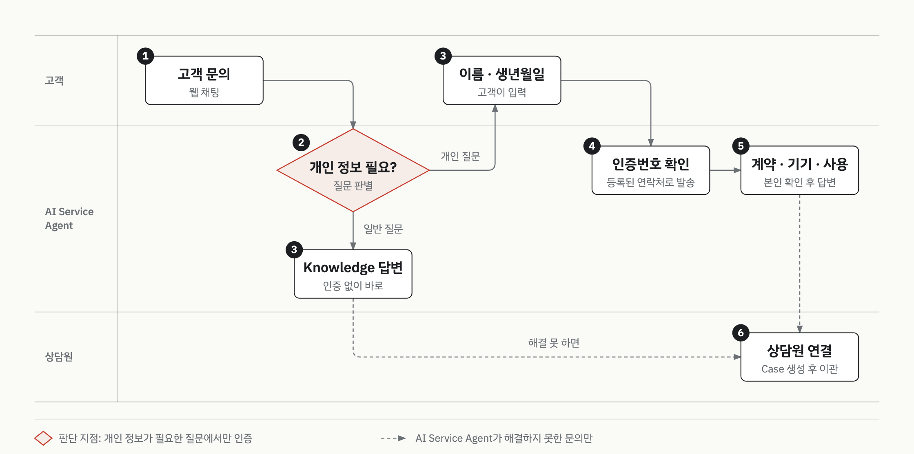

# 의료기기 렌탈 고객 상담 AI Service Agent 데모

> 고객사 보안상 고객사명과 데모 자료는 공개하지 않습니다.

| 항목 | 내용 |
|:--|:--|
| 구분 | 데모 (프리세일즈) |
| 기간 | 2026.04 |
| 역할 | AI Service Agent 구성, 데모 org 구축 |
| 제품 | Agentforce, Knowledge, Service Cloud |
| 상태 | 시연 (2026.04) |

## 맥락

의료기기를 렌탈하는 회사입니다.
고객은 사용법 같은 일반 질문과, 본인 계약·기기 사용 정보 같은 개인 질문을 함께 합니다.

현업이 겪던 문제는 이랬습니다.

- 웹 채팅 창구가 없어 모든 문의를 사람이 받았습니다.
- 들어오는 문의 대부분이 반복 질문이었습니다.
- 들어오는 문의에 인력이 묶여, 고객에게 먼저 연락하는 케어를 하지 못했습니다.

## 제약

- 고객사의 실제 org에는 접근하지 않았습니다. 제공받은 데이터 항목으로 구조를 유추해 데모 org를 구성했습니다.
- 의료기기 고객 정보라 일반 개인정보보다 높은 수준의 보호가 필요했습니다. AI가 고객을 잘못 매칭하면 다른 사람의 정보가 나갈 수 있습니다.
- 고객이 묻기 전에 먼저 연락하는 안내는 이번 데모 범위에서 뺐습니다.

## 프로세스 흐름

빨간 마름모가 판단 지점입니다. 개인 정보가 필요한 질문에서만 인증을 받습니다.

## 단계별 워크스루

### ① 고객 문의

- 고객 현재: 웹 채팅 창구가 없어 모든 문의를 사람이 받았습니다.
- 데모에서 보여준 것: 고객이 웹 채팅으로 문의하면 AI Service Agent가 먼저 응대합니다.
- 쓴 기능: AI Service Agent 웹 채팅
- 상태: 시연 (2026.04)

### ② 개인 정보 필요?

- 고객 현재: 고객사는 단순 질문의 비중이 크다고 말했습니다.
- 데모에서 보여준 것: AI Service Agent가 질문을 일반 질문과 개인 질문으로 가릅니다. 일반 질문은 인증 없이 답하고, 개인 질문에서만 인증으로 넘어갑니다.
- 판단: **처음부터 로그인을 강제하지 않았습니다.** 단순 질문은 인증 없이 답하고, 개인 정보가 필요한 지점에서만 인증을 받습니다. 처음부터 로그인을 요구하면 단순 질문을 하러 온 고객까지 허들을 넘어야 합니다.
  기각한 대안: 소셜 로그인 연동. 고객 이탈 허들이 커서 이름·생년월일과 인증번호 방식으로 정했습니다.
- 상태: 시연 (2026.04)

### ③ Knowledge 답변 · 이름·생년월일

질문 판별에서 두 갈래로 나뉩니다.

- 데모에서 보여준 것 (일반 질문): 기기 사용법·세척·소모품 같은 질문에 Knowledge 기반으로 바로 답합니다.
- 데모에서 보여준 것 (개인 질문): 고객에게 이름과 생년월일을 입력받습니다.
- 쓴 기능: Knowledge
- 판단: 전화번호를 직접 입력받지 않았습니다. 고객이 적은 번호는 본인 확인이 되지 않습니다. 이름·생년월일로 고객사 데이터에 등록된 고객을 찾고, 연락처는 등록된 것만 씁니다.
- 상태: 시연 (2026.04)

### ④ 인증번호 확인

- 데모에서 보여준 것: 이름·생년월일로 찾은 고객의 등록된 연락처로 인증번호를 보냅니다. 고객이 채팅에 입력한 번호와 보낸 번호가 맞으면 본인 확인이 끝납니다.
- 쓴 기능: 고객 조회와 인증번호 발송을 직접 구현했습니다.
- 상태: 시연 (2026.04)

### ⑤ 계약·기기·사용

- 데모에서 보여준 것: 본인 확인이 끝난 고객에게 계약·기기·사용 정보를 알려줍니다.
- 쓴 기능: 영업기회 → 계약 → 자산 구조
- 판단: **렌탈의 출발점이 되는 문서를 새 오브젝트로 만들지 않았습니다.** 데모 org에서는 표준 Opportunity가 그 역할을 맡았습니다. 그 문서 → 계약 → 기기로 이어지는 흐름이 영업기회 → 계약 → 자산 구조와 같았습니다.
- 상태: 시연 (2026.04)

### ⑥ 상담원 연결

- 데모에서 보여준 것: AI Service Agent가 해결하지 못한 문의는 Case를 만들어 상담원에게 넘깁니다.
- 쓴 기능: Service Cloud Case
- 상태: 시연 (2026.04)

## 결과

검증된 것:

- 웹 채팅에서 AI Service Agent가 일반 질문에 인증 없이 답하는 흐름을 시연했습니다.
- 이름·생년월일과 인증번호로 본인을 확인한 뒤 계약·기기·사용 정보를 답하는 흐름을 시연했습니다.
- 해결하지 못한 문의가 Case로 상담원에게 넘어가는 흐름을 시연했습니다.

아직 열린 질문:

- 로그인을 강제할지는 고객사 전략에 따라 뒤에 정할 문제로 남겼습니다.
- 데모 org는 유추한 구조로 만들었습니다. 고객사의 실제 데이터 구조에서 같은 흐름이 도는지는 확인하지 않았습니다.

## 재사용 원칙

다른 고객 제안에도 그대로 가져가는 판단 기준입니다.

- **인증은 개인 정보가 필요한 지점에서만 받습니다.** 처음부터 로그인을 요구하면 단순 질문을 하러 온 고객까지 허들을 넘어야 합니다.
- 새 오브젝트를 만들기 전에 표준 구조로 같은 흐름을 표현할 수 있는지 먼저 봅니다.

## 이 문서에 없는 것

- 고객사명과 업종을 특정할 수 있는 기기·문서명을 뺐습니다.
- 상담 인력·문의량 같은 고객사 수치를 뺐습니다.
- 소스 코드, 필드 API명, 인증번호를 보내는 외부 서비스명을 뺐습니다.
- 실제 화면 캡처 대신 일반 레이블로 다시 그린 도식만 넣었습니다.
