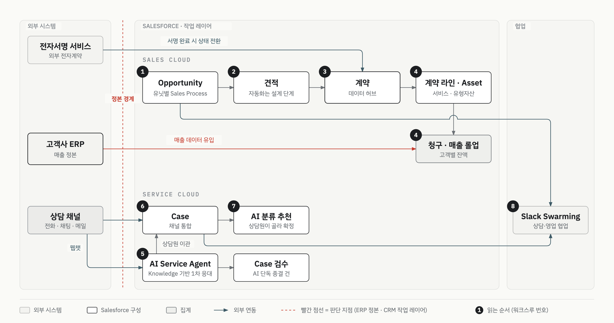

# B2B 구독 커머스 기업 CRM 구축

> 고객사 보안상 소스 코드와 고객사명은 공개하지 않습니다. 업무 구조, 설계 판단, 그리고 AI와 일한 방식만 정리합니다.

| 항목 | 내용 |
|:--|:--|
| 구분 | 고객 구축 프로젝트 (Salesforce 파트너사 뉴브릭) |
| 기간 | 2026.04 ~ 진행 중 |
| 역할 | 설계부터 Apex·Flow·배포까지 단독 수행 |
| 제품 | Sales Cloud, Service Cloud, Agentforce, Data Cloud |
| 작업 방식 | Claude Code·Codex + 프로젝트 하네스(issue-log, 규칙 capsule, 스킬, 훅 17개) |
| 상태 | Sandbox 구축 후 Production 이관 진행 중 (2026-10) |

## 맥락

기업 고객에게 서비스를 정기 공급하는 B2B 구독 커머스입니다. 사업 유닛이 여럿이고, 유닛마다 영업 방식이 다릅니다.

일하는 사람은 이렇습니다. 영업은 신규 계약을 따고, 영업관리는 계약 이후 기존 고객을 맡습니다. CX는 전화·채팅·메일 상담을 받습니다. 개발팀은 고객사가 자체 운영하는 ERP를 관리합니다.

현업이 겪던 문제는 이랬습니다.

- 사업 유닛마다 영업 방식이 달라 파이프라인이 여러 갈래로 나뉘어 있었습니다.
- 견적은 Excel로 수기 작성했습니다.
- 고객 상담이 전화·채팅·메일로 흩어져 있고, 상담 기록을 여러 곳에 이중으로 남겼습니다.
- 청구가 고객사 단위로 묶여 있어 서비스별 매출을 나눠 보기 어려웠습니다.

## 제약

- 매출 데이터의 원천은 고객사가 자체 운영하는 ERP였습니다. 현업은 ERP에서 데이터를 만드는 데 익숙했습니다.
- 서비스를 만드는 곳도 ERP입니다. CRM은 서비스와 매출을 받아 오는 쪽에 섭니다.
- 계약 서명은 외부 전자서명 서비스에서 이뤄집니다.
- 이 프로젝트는 처음부터 끝까지 혼자 맡았습니다. 6개월 동안 커밋이 715건 쌓였고, 같은 작업 폴더에서 AI 세션 2~3개를 동시에 돌렸습니다.

## 프로세스 흐름

박스의 번호는 업무가 흐르는 순서입니다. 영업기회에서 견적·계약을 거쳐 서비스·매출로 가는 영업 흐름이 하나 있습니다. AI 1차 응대에서 상담원 응대·분류 추천·Swarming으로 가는 상담 흐름이 또 하나 있습니다. 사람이 맡는 단계는 영업기회·견적·상담원 응대·Swarming입니다. 빨간 화살표는 서비스·매출을 ERP에서 받아 오기만 하는 경계입니다.

## 설계 판단

**CRM을 정본이 아니라 작업 레이어로 두었습니다.** 현업은 ERP에서 데이터를 만드는 데 익숙했습니다. CRM이 매출 정본 역할을 흉내 내면 두 시스템이 어긋납니다. 그래서 매출은 ERP에서 흘러오게 하고, CRM은 영업·상담이 일하는 자리로 잡았습니다. 같은 기준으로, 수주한 영업기회에서 서비스를 만드는 화면을 배포했다가 같은 날 되돌렸습니다. 서비스를 만드는 곳이 ERP였기 때문입니다. CRM만으로 끝나는 분석은 포기하고 ERP 연동 품질에 기대는 쪽을 택했습니다.

견적 하위 개념인 오입력 방지 장치는 만들지 않았습니다. 프로모션을 잘못 고를 수 있다는 우려가 있었지만, 막으려면 필드와 Flow를 늘려야 했습니다. Lookup Filter만으로는 부모 레코드의 값을 조건으로 읽지 못해 장치가 커질 수밖에 없었습니다. 잘못된 선택이 실제로 쌓이면 그때 가장 가벼운 Validation Rule을 넣기로 하고, 방지 대신 모니터링 조건을 두었습니다.

## AI로 일한 방식

### 왜 구조가 필요했나

처음 진행하는 AX프로젝트라 AI가 어디까지 할 수 있는 범위와 판단을 실험해보았습다. 그런데 AI는 세션이 끝나면 앞에서 정한 규칙을 잊습니다. 수정 전에 org에서 최신본을 받아 오라는 규칙을 여러 번 말했지만 세션이 바뀌면 또 어겼습니다. 그때 한 말이 이 구조의 출발점입니다.

> "지침 Memory에 남겨도 소용이 없더라. 전에 내가 몇번 말해서 그렇게 하겠다고 했는데 끊겼어"

그래서 기억에 기대지 않고, 기록과 강제 장치로 AI의 작업 방식을 고정했습니다.

### 장치 네 가지

| 장치 | 맡는 일 | 규모 (2026-10-02) |
|:--|:--|:--|
| issue-log | 실패와 재발 방지를 원문 에러 문자열 그대로 남긴다. 배포 기록(deploy-log)과 분리한다. | 124건 |
| 규칙 capsule | 발화를 보고 이번 작업에 필요한 규칙만 골라 주입한다. 항상 읽는 부팅 문서는 작게 유지한다. | 작업 유형 17개, capsule 11개 |
| 스킬 | 절차만 담는다. 이 org에서 나온 값은 프로젝트 파일에 둔다. | 15개 (공용 허브 연결 11개) |
| 훅 | 도구 호출 앞뒤에서 검사하고 막거나 경고한다. | 판단 스크립트 17개 |

위와 같은 규칙은 한 번에 설계하지 않았습니다. 사건이 생길 때마다 하나씩 생성,수정했고, 승격되는 순서가 정해져 있습니다. 처음 실패는 deploy-log에 사실만 적습니다. 같은 유형이 한 번 더 나오면 issue-log로 반영합니다. 같은 방향으로 두 번 이상 정정한 규칙은 capsule 규칙이 됩니다.

훅에도 기준이 있습니다. 실행을 막는 훅은 되돌릴 수 없는 일에만 둡니다. Credential 유출, Record 파괴, Local 원본 유실, 배포 정책 위반이 여기에 해당합니다. 나머지는 사람에게 다시 묻거나 경고만 합니다. 
Claude Code와 Codex는 같은 Python 판정 코드를 각자의 훅 이벤트에 연결해 씁니다.

### 한 세션의 흐름

1. **시작**: 라우터가 발화를 읽고 필요한 규칙 capsule을 고릅니다. 관련 issue도 최대 3건까지 붙입니다. Production 배포·데이터 삭제 같은 발화에는 "계획 먼저, 승인 대기"를 맨 앞에 붙입니다.
2. **편집**: 이번 세션에 org에서 받아 오지 않은 기존 메타데이터는 고칠 수 없습니다. 편집이 끝나면 설명 문구 형식을 검사합니다.
3. **데이터 변경**: 같은 세션, 같은 org에서 그 오브젝트를 조회한 기록이 없으면 데이터 변경 명령을 막습니다.
4. **에러**: 실패 출력에서 에러 시그니처를 뽑아 issue-log를 검색하고, 비슷한 사례를 바로 보여 줍니다.
5. **배포**: 정책 검사와 validate를 거쳐 배포 계획을 제시합니다. Sandbox 배포는 사용자가 확인한 뒤 AI가 실행합니다. Production 배포와 git tag는 사람이 합니다.
6. **마무리**: 마무리 스킬이 방향이 바뀐 지점을 내 발화 그대로 기록합니다. deploy-log·issue-log를 갱신하고, 정본으로 옮긴 memory는 지운 뒤 커밋합니다.

### 커밋 이력으로 본 성장

| 월 | 커밋 | 새로 생긴 것 |
|:--|--:|:--|
| 2026-04 | 44 | 첫 커밋 당일 훅 2개(세션 종료 체크, 배포 후 상태 문서 알림). 둘 다 `echo` 한 줄이었다. |
| 2026-05 | 77 | 배포 전 사전 점검 스크립트, 업무 개념 관계를 주입하는 훅 |
| 2026-06 | 154 | 에러가 나면 issue-log를 보게 하는 훅, 배포 정책 검사 |
| 2026-07 | 225 | 규칙 라우터와 capsule, 편집 전 org retrieve 강제, issue 시그니처 인덱스와 근거 게이트 |
| 2026-08 | 132 | 데이터 변경 가드, 가드 감사(차단을 확인으로 낮춤), 표준 기능을 먼저 찾게 하는 스킬 |
| 2026-09 | 75 | 훅 운영 문서, 여러 프로젝트가 같이 쓰는 issue 허브, 규칙 3단 계층 |
| 2026-10 | 8 | Production 이관 기록을 별도 폴더로 분리 |

### 사례

장치가 실제로 생긴 과정입니다. 각 사례는 어떤 작업에서 무엇을 발견했고, 어떻게 처리했고, 무엇이 남았는지 순서로 적었습니다.

<b>1. retrieve 유실 — 막는 장치가 새 유실을 만들었다</b>

- **작업**: 권한과 필드 메타데이터 편집.
- **발견 (07-14)**: Profile만 따로 retrieve하자 에러 없이 성공했는데 필드 권한이 하나도 없는 파일이 받아졌습니다. 그대로 커밋하고 재배포했다면 권한이 대량으로 지워졌을 것입니다.
- **처리 1 (07-24)**: "수정 전 retrieve" 규칙을 memory에 여러 번 남겼지만 세션마다 끊겼습니다. 그래서 이번 세션에 org에서 받아 오지 않은 기존 파일은 편집을 막는 훅을 만들었습니다.
- **새 문제 (07-27~08-04)**: 훅의 안내 문구를 따르자 권한이 지워졌습니다. 훅이 명령의 단축 플래그와 `cd &&` 접두어를 못 읽어 같은 차단이 6번 반복됐습니다. 차단 사유를 stdout으로 내보내서 AI에게는 "No stderr output"만 보였습니다. 문구를 바꾸고, 사유는 stderr로 옮기고, 코드 타입 매핑을 채웠습니다.
- **새 문제 (07-29)**: 설명 문구를 쓴 필드가 배포되기 전에 retrieve하자 문구가 org의 빈 값으로 덮였습니다. 이건 막지 않고 경고하는 가드로 처리했습니다. Setup에서 일부러 지운 경우까지 막으면 오차단이 되기 때문입니다.
  > "34개는 뭐야? 오그에 있는지 파악하고 오그랑 맞춰줘"
- **새 문제 (08-05)**: 번역 파일만 retrieve했다가 대량 삭제가 났습니다. 원인을 따라가 보니 편집 전에 retrieve하라는 훅을 따르는 것 자체가 유실 경로였습니다. 그래서 retrieve 직후 `git diff --stat`을 확인하는 규칙을 더했습니다.
- **남긴 기준**: 작성 → 배포 → 그다음 retrieve. 커밋됐다는 사실이 배포됐다는 뜻은 아닙니다.

<b>2. 가드 감사 — 측정해 보니 막는 장치를 줄여야 했다</b>

- **작업**: 가드가 쌓이면서 AI가 정상 작업에서도 자주 멈췄습니다.
- **발견 (08-06)**: 세션 로그 118개를 실측했습니다. 차단형 훅 6개 중 상시 작동하는 건 2개뿐이었고, 2개는 한 번씩만 발동했습니다. 결정 기록에 근거로 남긴 건 내 지적이었습니다. 파이썬 게이트가 너무 많으면 AI 활용에 스스로 한계를 긋는다는 것입니다.
- **처리**: 원칙을 문장으로 박았습니다. 되돌릴 수 있는 실수는 막지 않습니다. 오차단은 우회하는 습관을 가르칩니다. 이 원칙에 따라 issue 근거 검사는 차단에서 확인 요청으로 낮췄습니다. 새로 만든 org 드리프트 검사는 처음부터 확인 요청으로 두었습니다. 배포 오염은 git으로 되돌릴 수 있기 때문입니다.
- **오차단 교정**: heredoc 본문 안의 배포 명령 문자열을 실제 배포로 읽고 두 번 막았습니다. 명령의 모양을 판정하는 코드를 공용으로 분리하고 회귀 테스트를 붙였습니다. 이후에도 백슬래시 줄 연결(08-24), 삭제 배포(09-15)를 잘못 막아 고쳤습니다. 전체 배포에서는 위반 목록을 너무 길게 내보내 배포가 사실상 영구 차단되기도 했습니다(09-23). 그 뒤로 검사 범위를 못 잡으면 그 사실을 그대로 드러내고, 끌 수 있는 스위치를 두었습니다.

<b>3. 에러를 지식으로 — AI가 쓴 기록을 AI가 다시 읽게 하기</b>

- **발견 (06-30)**: 데모 데이터 생성에서 같은 실수가 반복됐습니다. AI가 이 실패를 스킬로 포장해 만들었습니다.
  > "Red는 Issue log로 가야 다시는 반복하지 않게 되는 거 아니야? Issue를 스킬로 만든다는 게 이해가 안 가는데?"

  스킬을 지우고 issue-log로 옮겼습니다. 스킬은 절차이고, 실패 이력은 issue-log가 정본입니다.
- **처리 (06-30)**: 기록만 있으면 소용이 없었습니다.
  > "근본 문제는 Claude가 error가 터졌을 때 issue log를 보고 action을 취할 수 있냐는 거야."

  에러 출력이 보이면 issue-log를 확인하라고 주입하는 훅을 만들었습니다.
- **구조화 (07-02~07-03)**: 에러 시그니처 인덱스를 만들고 memory에 흩어진 에러 지식을 issue-log로 옮겼습니다. 로그가 길어지면 벡터 검색을 붙일지 고민했습니다.
  > "그럼 이걸 벡터화로 구조화시키면 과설계라는거지?"

  원문 에러 문자열을 그대로 남기는 규칙이 있으니 정확 매칭으로 충분했습니다. 그래서 먼저 grep으로 찾는 원칙을 두고, 마무리 때 기존 시그니처가 있으면 그 항목에 사례를 붙이게 했습니다.
- **시험과 폐기 (07-06 → 09-10)**: Markdown을 정본으로 두고 검색용 SQLite 캐시를 시험했습니다. 9월에 여러 프로젝트가 같이 쓰는 issue 허브로 통합하면서 캐시는 백업 후 폐기했습니다. grep 원칙은 그대로 남았습니다.
- **품질 (07-14, 07-29)**: 새 issue에는 재현·반복 사례·공식 문서 URL 중 하나가 있어야 합니다. 파일이 커져서 전체를 읽지 않고 issue 블록 하나만 조회하는 도구를 만들었습니다.
- **지금 (09-10~)**: 에러가 나면 훅이 실패 출력에서 비밀값을 지운 시그니처를 뽑습니다. 그 시그니처로 프로젝트와 공용 허브를 검색해 최대 3건을 보여 주고, 같은 시그니처는 5분 동안 다시 알리지 않습니다.

<b>4. 데이터 변경 전 org 조회 — "org를 보고 말해라"를 코드로</b>

- **반복된 지적 (07월)**: AI가 로컬 파일만 보고 org 상태를 단언하는 일이 여러 번 있었습니다.
  > "org 기준으로 로컬에 있는걸 계속 업데이트 해야해."
- **발견 (08-04)**: AI가 로컬 파일 목록만 보고 org에 없는 필드를 있다고 답했습니다. 조회 쿼리를 짜자마자 컬럼이 없다는 에러가 났습니다. 규칙 문서에 이미 "org 기준으로 대상을 고정하라"가 있었지만 지켜지지 않았습니다.
- **처리**: 조회 기록 훅과 변경 차단 훅을 한 쌍으로 만들었습니다. 같은 세션, 같은 org에서 그 오브젝트를 성공적으로 조회한 기록이 30분 안에 없으면 데이터 변경을 막습니다. 변수로 조립된 명령은 대상을 확정할 수 없어 경고만 합니다.
- **확장 (10-01)**: Production 데이터 이관은 건별 승인을 받습니다. 순서도 고정했습니다. 원본 기록 → 백업 → 사전 건수 → 소량 시험 → 나머지 → 사후 전수 대조 순입니다.

<b>5. 문장 규칙과 코드 강제 사이 — 아직 열린 간격 (2026-10-02 점검)</b>

- **점검**: 직접 쓴 Flow XML에 Auto-Layout 캔버스 설정을 넣으라는 규칙이 capsule에 문장으로만 있습니다. 검사하는 코드는 없고, 개별 Flow 테스트 4개만 이 설정을 확인합니다.
- **결과**: Flow 27개 중 1개가 규칙을 어기고 있습니다. 규칙이 생기기 전 org 전체 싱크로 들어온 파일입니다.
- **같은 종류**: Apex 수정 이력 줄과 deploy-log 형식도 반복해서 지적했지만 문장만 강화했고 검사 코드는 없습니다.
- **판단**: 훅으로 올라간 규칙은 모두 같은 실수가 반복돼 내가 지적한 것들입니다. 이 간격은 승격 순서에서 아랫칸에 머문 규칙이 어디 있는지 보여 줍니다. 다음에 올릴 후보입니다.

### 만들지 않은 것, 되돌린 것

- 업무 개념 관계를 프롬프트마다 펼치던 온톨로지 훅은 두 달 만에 폐기했습니다(05-08 → 07-10). 효율 대비 성능이 낮았습니다. 대신 필요한 규칙만 고르는 라우터로 바꾸자 항상 읽는 부팅 문서가 25,984B에서 9,013B로 줄었습니다.
- issue-log에 벡터 검색을 붙이지 않았습니다. 원문 보존 규칙이 있어 grep으로 충분했습니다.
- 실패 이력을 담은 스킬은 지우고 issue-log로 옮겼습니다.
- 검색용 SQLite 캐시는 시험한 뒤 폐기했습니다.
- 차단형 훅 일부를 확인 요청으로 낮췄습니다.

## 결과

- 웹챗에서 AI Service Agent가 먼저 응대하고, 필요하면 상담원에게 넘기는 흐름을 Sandbox 채팅으로 확인했습니다.
- AI가 혼자 끝낸 대화가 검수 단계로 바뀌고, 상담원이 이어받은 대화는 그대로 남는 것을 확인했습니다.
- AI 분류 추천을 Sandbox에 배포하고 활성화했습니다.
- 2026-10 현재 오브젝트·필드와 Apex·LWC·Flow를 Production에 이관했습니다. 나머지 설정·리포트와 데이터 이관이 진행 중입니다.
- 하네스는 echo 훅 2개에서 판정 스크립트 17개, issue 124건으로 자랐습니다. 장치마다 생긴 날짜와 계기가 커밋 이력과 issue-log에 남아 있습니다.
- 훅 테스트는 합성 입력 기준입니다. 새 세션에서 실제로 발동하는지는 따로 확인합니다.

## 재사용 원칙

다른 고객 프로젝트에도 그대로 가져가는 판단 기준입니다.

- **정본 판정을 먼저 합니다.** 기능이 아니라 현업이 어디서 데이터를 만드는 데 익숙한지, 이력이 어디에 남는지로 시스템을 가릅니다.
- 문제가 실증되기 전에는 최소 장치로 버팁니다. 필드·자동화 하나마다 유지보수와 입력 부담이 붙으므로, 방지 장치 대신 모니터링 조건을 둡니다.
- AI 작업 장치도 같은 기준을 따릅니다. 기록 → 규칙 → 훅 순으로 올리고, 실행을 막는 훅은 되돌릴 수 없는 일에만 둡니다.
- 한 사실은 한 자리에 둡니다. 실패 이력은 issue-log, 절차는 스킬, 그 org의 값은 프로젝트 파일에 둡니다. 두 곳에 두면 하나가 먼저 낡습니다.

## 적용한 개념

구현에 쓰인 자료구조·알고리즘 개념입니다.

- **큐** — Omni-Channel 큐 맨 앞에 아무도 받을 수 없는 건이 서서 뒤 채팅 배정이 전부 멈춘 문제(head-of-line blocking)를 찾아, 막힌 건을 처리해 풀었습니다. 큐는 앞에서부터 꺼내므로 재발 방지로 한 큐에는 서비스 채널을 하나만 두는 기준을 세웠습니다.
- **재귀 방지** — 점수 재계산이 저장을 일으키고 그 저장이 다시 재계산을 부르는 자기순환을 정적 플래그로 끊었습니다. 같은 트랜잭션 안의 재진입이라 플래그 하나로 확실히 가려집니다.
- **그리디 배정** — 영업기회 자동 배정에서 잔여 용량이 가장 큰 담당자에게 먼저 주고, 동점이면 라운드로빈으로 돌립니다. 매 건 그 순간의 최선을 고르면 전체 최적을 계산하지 않아도 부하가 한쪽에 쏠리지 않습니다.
- **해시 집합 중복 제거** — AI 분류 추천에 넣을 통화 전사를 두 경로에서 합친 뒤 통화 ID 집합으로 중복을 걸렀습니다. 한 경로를 먼저 읽고 끝내면 다른 경로에만 있는 통화를 놓치는 사례가 실제로 있었습니다.
- **배치 청킹과 큐 체이닝** — 알림 발송은 Batch Apex로 발송 호출 한도에 맞춘 크기로 나눠 보냅니다. 사례 종료 설문 발송은 Queueable이 남은 건을 들고 자신을 다시 넣어 이어 처리해, 한 트랜잭션의 한도를 넘지 않고 끝까지 갑니다.

## 이 문서에 없는 것

- 고객사명과 사업 유닛명을 뺐습니다.
- 성과 수치와 고객 데이터 건수를 뺐습니다. 남긴 수치는 커밋·issue·훅처럼 작업 방식에 관한 것뿐입니다.
- 소스 코드, 필드 API명, 내부 도구와 외부 서비스의 제품명, 훅 코드와 규칙 원문을 뺐습니다.
- 실제 화면 캡처 대신 일반 레이블로 다시 그린 도식만 넣었습니다.
