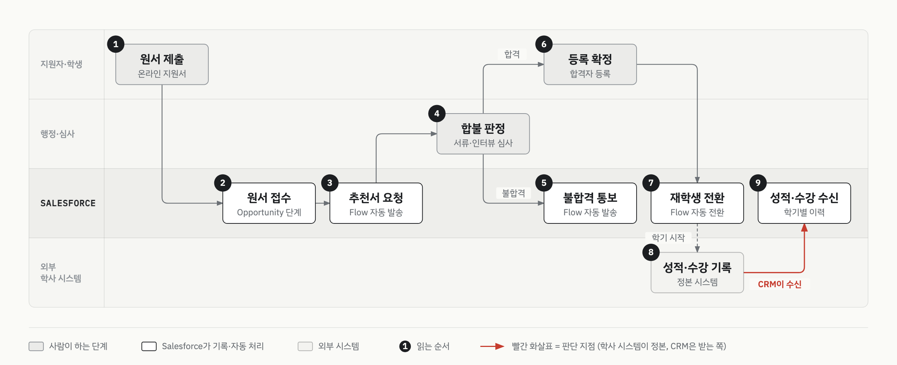

# 온라인 대학원 학사행정 CRM 구축

> 고객사 보안상 소스 코드와 고객사명은 공개하지 않습니다. 업무 구조와 설계 판단만 정리합니다.

| 항목 | 내용 |
|:--|:--|
| 구분 | 고객 구축 프로젝트 (Salesforce 파트너사 뉴브릭) |
| 기간 | 2025.12 ~ 2026.02 (완료) |
| 역할 | 설계·구축 |
| 제품 | Sales Cloud 기반 커스텀 앱, Flow, Apex |
| 상태 | 구축 완료 (2026.02) |

## 업무 문제

- 통합 학사 시스템(SIS) 없이 학사·강의·인터뷰·메일·웹 회원 도구 여러 개를 조합해 쓰고 있었습니다.
- 도구 사이는 사람이 스프레드시트와 이메일로 옮겨 적으며 이어 붙였습니다.
- 모집부터 졸업까지를 소수 행정 인력이 겸임했습니다.

## 프로세스 흐름

도식에서 사람이 맡는 단계는 원서 제출, 합불 판정, 등록 확정입니다. 그 사이의 기록·발송·전환은 Salesforce가 맡습니다. 빨간 화살표는 성적·수강을 학사 시스템에서 받아 오기만 하는 경계입니다.

## 구축 범위

- 입학 지원서를 Opportunity로 모델링했습니다. 지원 단계가 곧 파이프라인 Stage가 됩니다.
- 추천서 발송, 불합격 통보, 재학생 전환을 Flow로 자동화했습니다.
- 과정·과목·학기 같은 기준 정보와, 학생별 학적·학기 등록·수강 이력을 분리했습니다.
- 외부 학사 시스템의 성적·수강 데이터를 CRM으로 받아오게 했습니다.
- 등록금·장학 거래를 기록하고 잔액을 롤업으로 계산했습니다.
- 웹사이트 회원가입을 서명 검증을 거치는 단일 REST 진입점으로 받았습니다.
- 장학 유지 재판정과 졸업 사정은 이번 범위 밖입니다.

## 설계 판단

**학사 시스템을 정본으로 두고 CRM은 받는 쪽으로 설계했습니다.**
성적·수강·등록금의 원천은 학사 시스템입니다. CRM이 그 데이터를 다시 만들면 두 곳이 어긋납니다. 어느 시스템이 정본인지를 먼저 정했습니다.

**입학 지원을 영업 파이프라인으로 봤습니다.**
지원서는 단계, 전환율, 리마인드, 탈락 사유를 가집니다. 영업기회와 구조가 같습니다. 그래서 표준 Opportunity를 쓰고, 지원 단계가 바뀌면 안내 메일이 나가도록 이었습니다.

**기준 정보와 실적을 나눴습니다.**
과정·과목·학기의 "마스터"와 학생별 "실적"을 분리했습니다. 커머스의 상품 마스터와 주문을 나누는 것과 같은 구조입니다. 학생 여정이 여러 해에 걸쳐 휴학·복학을 오가기 때문에, 한 시점 스냅샷이 아니라 학기 단위 이력을 중심에 뒀습니다.

## 결과 (before → after)

| 영역 | 이전 | 이후 | 상태 |
|:--|:--|:--|:--|
| 원서 진행 | 진행 상태를 스프레드시트에 수기로 병행 기록 | Opportunity 단계로 추적 | 구축 완료 (2026.02) |
| 재학생 전환 | 합격자를 재학생으로 수기 전환 | 수강 준비 단계가 되면 Flow가 재학생으로 자동 전환 | 구축 완료 (2026.02) |
| 성적·수강 조회 | 학사 시스템에 들어가 따로 확인 | 학사 시스템 데이터를 CRM이 받아 학기별 이력으로 표시 | 구축 완료 (2026.02) |

## 재사용 원칙

다른 고객 프로젝트에도 그대로 가져가는 판단 기준입니다.

- **정본 판정을 먼저 합니다.** 원천 데이터를 가진 시스템이 이미 있으면 CRM은 받는 쪽에 섭니다.
- 업종이 달라도 단계·전환·탈락 사유를 가진 흐름이면 표준 Opportunity로 받습니다.
- 기준 정보와 실적을 먼저 나눕니다. 상태가 자주 바뀌는 대상은 스냅샷 대신 기간 단위 이력으로 둡니다.

## 이 문서에 없는 것

- 고객사명, 과정명, 소속 기관 정보를 뺐습니다.
- 성과 수치(건수·비율)와 금액을 뺐습니다.
- 소스 코드, 필드 API명, 외부 서비스의 제품명을 뺐습니다.
- 실제 화면 캡처 대신 일반 레이블로 다시 그린 도식만 넣었습니다.
