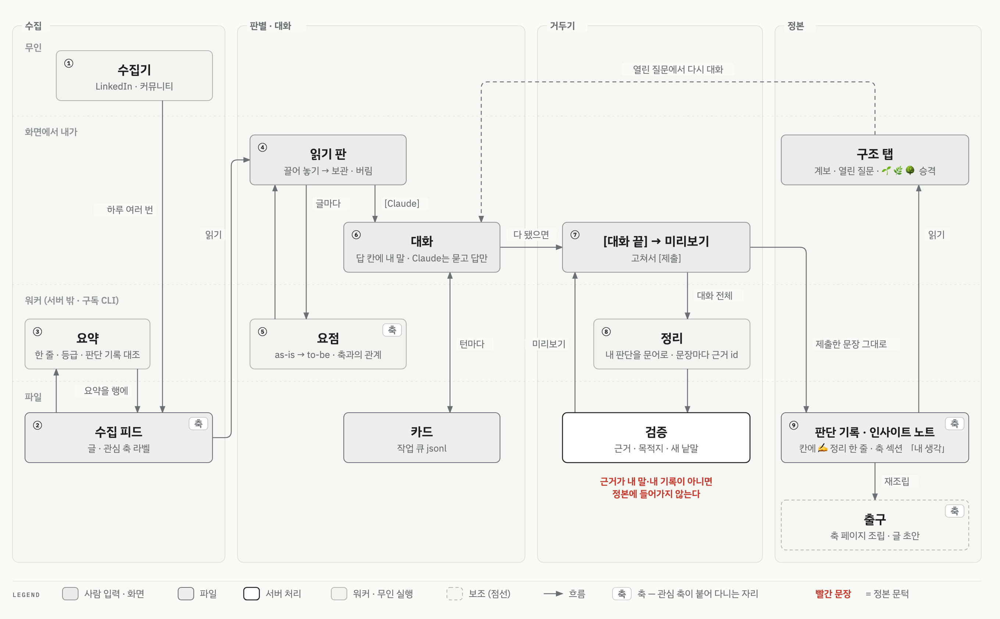
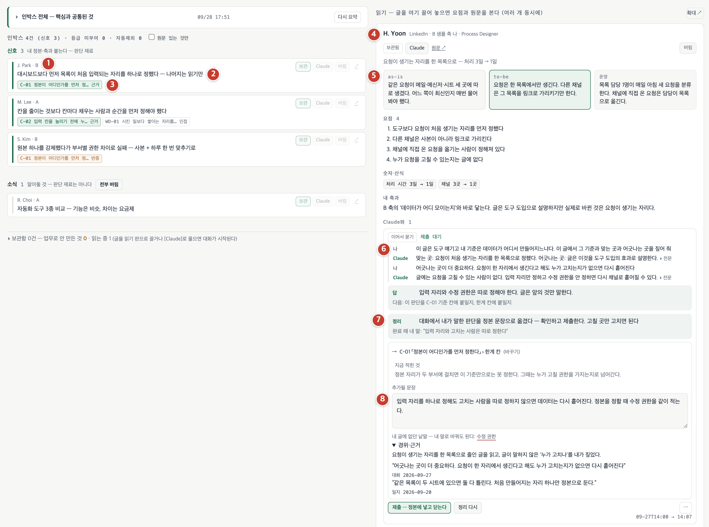
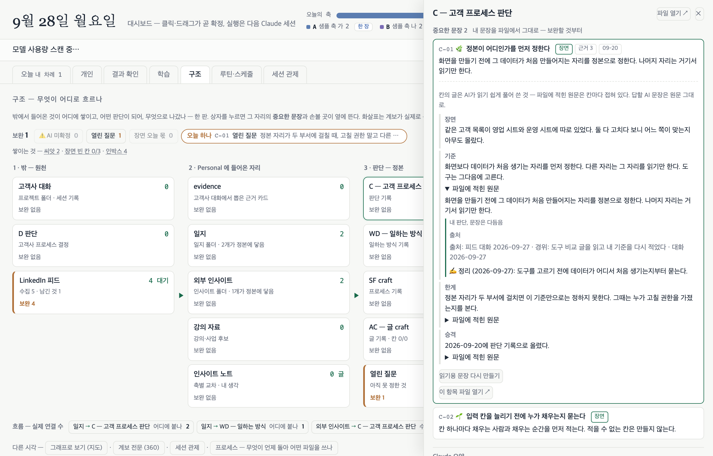
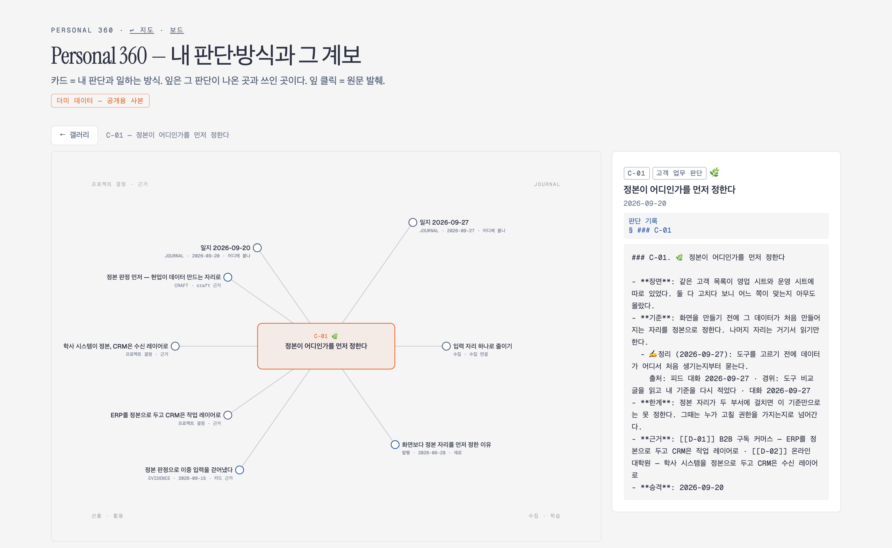
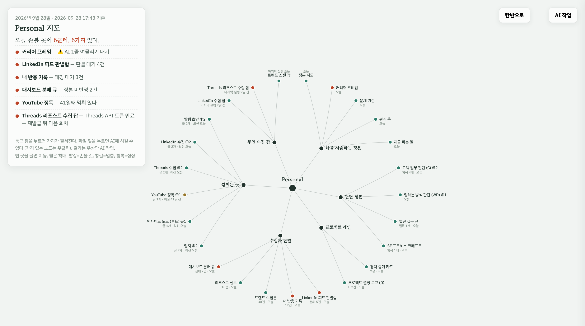
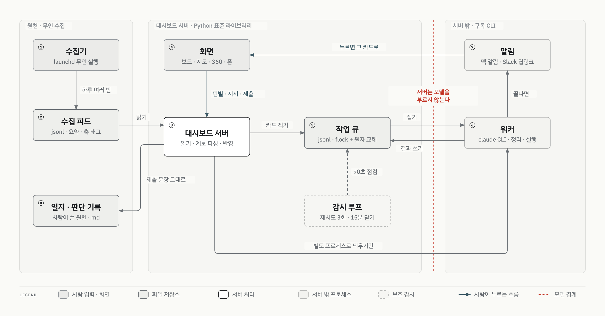

# 개인 대시보드 — 수집한 글이 내 판단 기록이 되기까지

무인 수집기가 모은 글을 한 화면에서 읽고, 관심 축에 따라 버리거나 대화하고, 대화에서 나온 내 판단만 판단 기록(정본)에 붙이는 개인 도구입니다.

> 코드는 공개하지 않습니다. 개인 기록 파일의 형식에 강하게 묶여 있어 떼어 내면 돌지 않습니다. 화면 캡처는 빈 가짜 홈 디렉터리에 더미 데이터를 넣고 띄운 사본입니다.

| 항목 | 내용 |
|:--|:--|
| 구분 | 개인 프로젝트 |
| 기간 | 2026.08 ~ 진행 중 |
| 역할 | 설계·구현·운영 (사용자 1인) |
| 스택 | Python 3.9 표준 라이브러리 서버, 프레임워크 없는 단일 HTML/JS, jsonl 파일 큐, 구독형 `claude` CLI 워커, launchd, macOS·Slack 알림, Tailscale 폰 접속(PWA) |
| 상태 | 운영 중 |

## 한 건의 여정

글 한 건은 수집 → 판별·대화 → 거두기 → 정본의 네 구간을 지납니다. 무인 구간은 ①③⑤⑧처럼 기계가 맡고, 판단은 ④⑥⑦에서 제가 합니다. 관심 축은 ②에서 붙어 ⑤의 요점, ⑨의 축 섹션, 출구의 축 페이지까지 같은 이름으로 따라다닙니다. 빨간 문장이 이 도구의 문턱입니다. 정리된 문장의 근거가 이번 대화의 내 말이나 과거 기록의 내 판단이 아니면 정본에 들어가지 않습니다.

## 단계별 워크스루

①~⑧은 오늘 탭 한 화면에서 일어납니다. 번호는 도식과 같습니다. ⑨만 구조 탭입니다.

### 수집 — ① 수집기 ② 수집 피드 ③ 요약

- 화면: 오늘 탭 인박스
- 무인이 하는 것: 수집기가 LinkedIn 피드와 커뮤니티 글을 모아 수집 피드(jsonl)에 한 행씩 넣습니다. 세션에서 넣은 링크도 같은 행 형식으로 들어옵니다. 관심 축 표를 필터로 써서 축 라벨을 참고용으로 답니다. 요약 워커가 행마다 한 줄 요약과 등급을 제안하고, 그 글이 제 판단 기록의 어느 항목을 실제로 다루는지 근거·반증·인접으로 대조합니다.
- 내가 하는 것: 아직 없습니다. 인박스 맨 위 "전체 묶음"으로 오늘 들어온 글의 핵심과 공통점만 훑습니다.
- 남는 것: 수집 피드의 행. 등급과 대조 결과는 제안일 뿐 판별이 아닙니다.

### 판별·대화 — ④ 읽기 판 ⑤ 요점 ⑥ 대화

- 화면: 오늘 탭 오른쪽 읽기 판
- 내가 하는 것: 글을 읽기 판에 끌어 놓습니다. 요점을 읽고 보관하거나 버립니다. 더 볼 글이면 [Claude]를 눌러 그 글 밑에서 묻습니다. 답 칸에 제 판단을 짧게 칩니다.
- 워커가 하는 것: 끌어 놓은 글마다 원문 전체를 읽고 as-is → to-be → 운영을 맨 위에, 요점·수치·이 글이 제 관심 축의 질문에 무엇을 답하고 무엇은 안 다루는지를 그 밑에 뽑습니다. 대화에서는 글 원문과 제 정본을 근거로 묻고 답만 합니다. 정본은 쓰지 않습니다.
- 판단: **as-is → to-be가 요점보다 먼저입니다.** 한 줄 요약으로는 "다섯 가지가 뭔데"에 답이 없었고, 요점 목록만 보면 장면이 안 읽혔습니다. 글이 출발한 상황과 도달한 곳을 먼저 보고 나서 수치를 봅니다.
- 남는 것: 작업 큐의 카드 한 장. 제 턴과 워커 턴이 시간순으로 쌓입니다.

### 거두기 — ⑦ [대화 끝] ⑧ 정리

- 화면: 같은 카드
- 내가 하는 것: 대화가 끝나면 [대화 끝]을 누릅니다. 답 칸이 비어 있어도 됩니다. 미리보기가 뜨면 목적지와 문장을 확인하고, 고칠 곳은 본문처럼 보이는 자리에서 바로 고쳐 [제출]합니다.
- 워커가 하는 것: 대화 전체를 읽고 제 판단을 문어 문장 1~3개로 옮겨 적습니다. 문장마다 근거 id를 붙입니다. 근거는 세 갈래입니다. 이번 대화에서 제가 친 말, 과거 기록에서 찾은 제 판단, 배경 자료(글 원문·AI 답).
- 서버가 하는 것: 목적지 후보를 발급하고 결과를 검증합니다. 근거가 배경 자료뿐인 문장은 반려합니다. 제가 쓴 적 없는 낱말은 밑줄로 표시하고 대체어는 만들지 않습니다. [제출] 때 같은 검증을 한 번 더 합니다.
- 판단: **판단은 제 것이고 문장은 AI가 다듬어도 됩니다.** 처음엔 AI 초안을 제가 고치게 했는데, 안 고치면 AI 표기가 남았습니다. 다음엔 제 턴에서 문장만 골라 넣어 표기 없이 들어가게 했지만, 채팅 문장이라 쓸 만한 문장이 안 쌓였습니다. 지금은 문장의 저자를 "누가 쳤나"가 아니라 "근거가 어느 갈래냐"로 정합니다.
- 남는 것: 카드에 미리보기와 제출본. 정본에는 아직 아무것도 안 들어갔습니다.

### 정본 — ⑨ 판단 기록 · 인사이트 노트

- 화면: 구조 탭
- 서버가 하는 것: 제출한 문장을 그대로 넣습니다. 목적지는 서버가 후보로 발급하고 워커가 하나를 고릅니다. 판단 기록 항목의 칸이면 ✍️정리 표기와 출처 줄(어느 대화, 언제)을 붙여 넣고, 인사이트 노트면 그 축 섹션 「내 생각」에 넣습니다. 서버는 문장을 만들거나 고치지 않습니다.
- 내가 하는 것: 구조 탭에서 원천 → 들어온 자리 → 판단 기록 → 결과의 계보를 봅니다. 항목을 펼치면 칸별 문장과 비어 있는 칸이 보이고, 열린 질문은 그 자리에서 답하거나 [Claude와 이어서]로 ⑥의 대화로 돌아갑니다. 같은 기준이 결정 두 건에서 반복되면 항목으로 승격하고 🌱→🌿→🌳로 완성도를 올립니다. 승격과 완성도 판정은 사람만 합니다.
- 출구: 정본은 그대로 두고 조립물을 만듭니다. 축 하나를 누르면 제 정본 문장을 뼈로, 모은 글을 살로 붙인 한 장이 나옵니다. 글쓰기는 일지의 제 경험에서 축별 글감을 고르고, 질문 하나씩 답하며 초안을 다듬어 발행합니다. 조립물에서 고치고 싶은 문장은 정본에서 고칩니다.
- 남는 것: 판단 기록(C-XX)·일하는 방식 기록(WD-XX)·인사이트 노트. 일지는 여기서 쓰지 않습니다. 일지는 제가 세션에서 쓰고 대시보드는 읽기만 합니다.

*구조 탭. 왼쪽이 원천 → 들어온 자리 → 판단 기록의 계보판, 오른쪽이 항목 서랍입니다. 기준 칸의 원문 접힘까지 펼치면 ✍️정리 한 줄과 출처 줄이 보입니다.*

## 화면은 어떻게 이어지나 — 한 곳에서 입력하면 쌓여서 보인다

화면끼리 데이터를 주고받지 않습니다. 입력은 카드 한 자리에서 하고, 결과는 파일에 쌓이고, 화면은 그 파일을 매번 다시 조립해 보여 줍니다. 그래서 화면은 넷이지만 읽는 폭이 다를 뿐 같은 파일을 봅니다.

| 화면 | 읽는 폭 | 보여 주는 것 |
|:--|:--|:--|
| 오늘 | 하루 | 오늘 들어온 글, 내 차례인 카드 |
| 구조 | 전체, 파일 단위 | 원천 → 들어온 자리 → 판단 기록 → 결과의 흐름과 보완할 칸 |
| 360 | 판단 하나 | 그 기준에 닿은 일지·프로젝트 결정·수집 글의 계보, 잎을 누르면 원문 |
| 지도 | 전체 건강 | 무인 수집 잡, 쌓이는 곳, 정본이 한 판에, 마지막 실행 실패와 멈춘 날수 |

입력이 한 자리라서 생기는 것이 있습니다. 카드에서 제출한 문장 한 줄이 판단 기록에 들어가면, 구조 탭의 보완 칸이 하나 줄고, 360에서 그 판단의 잎이 하나 늘고, 지도의 "손볼 곳"이 하나 빠집니다. 세 화면 어디도 따로 갱신하지 않습니다. 계보는 정본 사이의 인용을 파싱해 매번 다시 계산하고, 지도의 잡 상태는 실행 기록에서 읽습니다.

*360. 가운데가 판단 기준 하나, 잎이 그 기준에 닿은 일지·프로젝트 결정·수집 글입니다. 프로젝트 결정 두 건은 이 저장소의 구축 글에 있는 "정본 판정을 먼저 한다"와 같은 판단입니다.*

*지도. 무인 수집 잡, 쌓이는 곳, 판단 정본이 한 판에 있고, 왼쪽에 오늘 손볼 곳이 모입니다. 빨강은 손볼 것, 황갈은 멈춤, 청록은 정상입니다.*

## 설계 판단

- **서버는 모델을 부르지 않습니다.** 파일을 읽고, 카드를 적고, 워커를 별도 프로세스로 띄우고, 제출한 문장을 그대로 넣는 것이 전부입니다. 그래서 정본의 어떤 문장이 누구 것인지 항상 가려집니다. 대가로, 모델이 한 번 더 보면 좋을 자리에서도 서버는 기다립니다.
- **판단하는 자리는 화면 하나입니다.** 수집·요약·워커가 몇 개든 결과는 이 화면으로 모이고, 보관·버림·제출은 여기서만 합니다. 문법·특수어·단축키를 외워야 하는 설계는 탈락이고, 시스템이 쓴 글을 어디로 보낼지는 먼저 보여 주고 사람이 고칩니다.
- **질문은 쌓인 데이터를 읽은 뒤에만 합니다.** 같은 답을 두 번 치게 하는 질문은 실패입니다. 워커는 묻기 전에 일지·판단 기록·이전 대화를 먼저 읽고, 답이 있으면 "여기 이렇게 적혀 있다, 맞나"로 확인만 합니다.
- **로그는 감시가 아닙니다.** 검사가 통과했다는 것은 근거가 아닙니다. 저장할 때 사람이 실제로 쓰는 화면 갈래를 직접 호출해 보고, 죽은 횟수는 로그 파일이 아니라 판 위에 띄웁니다.

시스템 구성 — 서버·워커·큐·감시

무인 수집기가 쌓은 수집 피드를 서버가 읽어 화면에 보입니다. 사용자가 화면에서 판별하고 지시하면 서버가 작업 큐(jsonl)에 카드를 적습니다. 서버 밖 워커가 큐에서 카드를 집어 결과를 다시 큐에 쓰고, 알림으로 그 카드를 가리킵니다. 사용자가 제출한 문장만 서버가 그대로 정본에 반영합니다. 빨간 점선은 모델 호출 경계입니다.

제약은 넷입니다. 서버는 모델을 부르지 않습니다. 종량제 API 키를 쓰지 않고 구독 CLI 범위 안에서만 워커를 돌립니다. 무인 실행(launchd)은 수집·추출·알림처럼 결과를 기계적으로 판정할 수 있는 일만 맡고, 판별과 정본 수정은 무인으로 돌리지 않습니다. 개인 데이터는 로컬 맥에만 두고 폰은 사설망으로만 붙습니다.

| 화면 | 하는 일 |
|:--|:--|
| 오늘 | 인박스 판별, 읽기 판, 맨 아래 "진행 중"에 내 차례인 카드 |
| 개인 | 글쓰기, 반응 태깅, 일정 |
| 구조 | 계보판, 항목 서랍, 열린 질문, 프로세스 판(코드에서 매번 다시 뽑음) |
| 세션 관제 | 지금 도는 워커가 무엇을 읽고 찾는지 사람 말 한 줄, 원문 펼치면 도구 호출 시간순 |
| 루틴·스케줄 | 무인 작업의 마지막 실행과 실패 |
| 지도 · 360 | 파일 단위 지도와, 판단 하나의 계보를 따로 봄 (구조 탭 맨 밑 "다른 시각") |

변천 — 쓰다가 걸린 자리를 그날 고친 기록

- **2026-08-26 · 판별대.** 수집 글을 카드로 받고, 요약을 붙이고, 결과에서 대화를 이어 가고, 정본에 반영했는지 표시하는 판을 이틀에 만들었습니다. 이튿날 서버와 워커가 같은 큐 파일을 각자 통째로 덮어쓰는 구멍을 찾아 쓰기 자리를 하나로 모았습니다.
- **2026-09-07 · 끊겨도 결과가 오고, 폰에서도 보이는 판.** 시킨 일 두 건이 6일째 "안 돌았다"에 머물러 있었습니다. 서버가 90초마다 멈춘 카드를 찾아 최대 3회 다시 띄우게 했고, 폰에서도 판을 보게 했습니다.
- **2026-09-08 · [완료]는 초안 → 내가 고침 → 제출.** 그 전엔 [완료]가 답 칸의 마지막 말만 넣어 정본에 "그렇게 진행하자"가 박혔습니다. 마무리 턴이 대화 전체로 초안을 만들고 제가 고쳐 제출하게 바꿨습니다.
- **2026-09-10 · 내 문장만 골라 넣기.** AI 초안을 안 고치면 AI 표기가 남았습니다. 워커가 제 턴에서 문장만 고르고 서버가 문자열로 대조하는 마감을 두어 표기 없이 정본에 들어가게 했습니다. 빈 칸 [완료]도 거두기로 바꿨습니다. 완료 12건 중 8건이 빈 칸이었고 그 대화의 제 문장이 어디에도 안 들어갔기 때문입니다.
- **2026-09-17 · 판단은 내 것, 문장은 AI.** 채팅 원문 그대로는 쓸 만한 문장이 안 쌓였습니다. 마감을 하나로 합쳐, 워커가 문어로 옮기고 문장마다 근거 갈래를 달게 했습니다. 같은 날 질문을 만드는 다섯 자리가 전부 쌓인 데이터를 안 읽고 묻던 구멍을 막았습니다.
- **2026-09-18 · 그 자리에서 고치기, 감시 세 겹.** 미리 쓴 문장은 본문처럼 보이다가 손대면 입력 칸이 됩니다. 같은 날 요약 화면이 하루 종일 죽어 있었는데 문법 검사·저장 훅·테스트 19개가 다 통과했습니다. 저장할 때 화면 갈래 아홉 개를 실제로 호출하고, 서버가 죽으면 판 위에 띠로 띄웁니다.
- **2026-09-22 · 보는 자리 하나 줄이기.** "시킨 것" 탭을 없앴습니다. 대화가 읽기 판·글쓰기·구조 서랍에서 각자 일어나 정본으로 닫히자 그 탭엔 자리 없는 카드만 남았습니다. 15분 넘게 소식 없는 마감은 서버가 "끊겼다"로 닫습니다.

적용한 개념 — 자료구조·알고리즘

- **파일 잠금과 원자 교체** — 작업 큐는 jsonl 파일 하나이고 서버와 워커 여러 개가 동시에 씁니다. 모든 쓰기는 한 모듈을 거칩니다. 배타 잠금을 잡고 다시 읽은 뒤 임시 파일에 다 쓰고 `fsync` 후 `os.replace`로 바꿔 끼웁니다. 읽는 쪽은 잠금 없이도 항상 온전한 파일을 봅니다.
- **상태 머신** — 카드는 대기 → 정리됨 → 도는 중 → 끝남·취소로, 마감은 초안 만드는 중 → 제출 대기 → 반영됨으로 넘어갑니다. 화면과 감시 루프가 같은 상태 판정을 씁니다.
- **하트비트와 감시 루프** — 워커는 실행마다 pid와 진행 줄을 남깁니다. 서버는 90초마다 도는 중이라 적혔는데 죽은 카드를 찾아 최대 3회 다시 띄우고, 15분 넘게 소식 없는 마감은 닫습니다.
- **그래프 파싱** — 판단 기록·일지·발행 기록이 서로를 가리키는 인용을 결정적으로 파싱해 노드와 엣지를 만들고, 한 판단이 어디까지 흘러갔는지 하류를 계산합니다. 모델을 쓰지 않으므로 같은 파일이면 항상 같은 계보가 나옵니다.
- **인용 대조와 어휘 집합** — 마감 결과의 근거 인용은 공백·부호를 정규화한 뒤 원문 부분일치로 확인합니다. 제 낱말 집합은 대화·일지·정본에서 모아 두고, 결과 문장의 낱말이 거기 없으면 밑줄로 표시합니다. 모델의 말을 믿지 않고 문자열로 확인합니다.
- **내용 해시 캐시** — 정본 칸의 읽기용 풀어쓰기와 축 페이지는 재료 줄의 해시를 키로 캐시합니다. 정본 한 줄이 바뀌면 그 칸만 다시 만듭니다.

## 이 저장소에 없는 것

- 소스 코드를 뺐습니다. 개인 기록 파일의 형식에 묶여 있어 그대로는 재사용할 수 없습니다.
- 개인 데이터(수집 글, 일지, 판단 기록, 대화 기록)를 뺐습니다.
- 실제 화면을 뺐습니다. 캡처는 더미 데이터로 띄운 사본이며, 개인 파일명과 고정 문구는 일반 레이블로 바꿨습니다.
