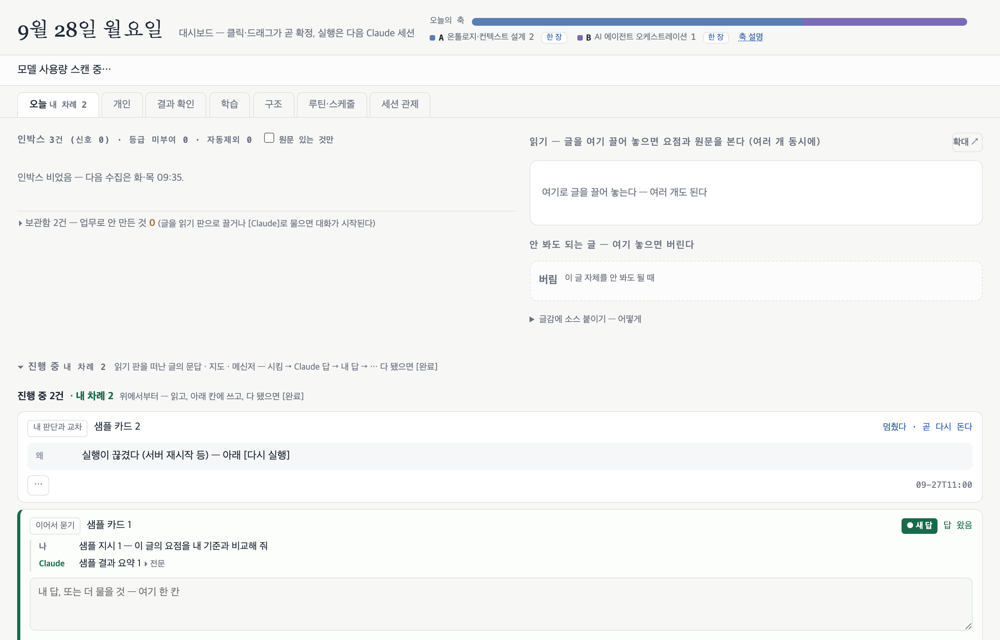
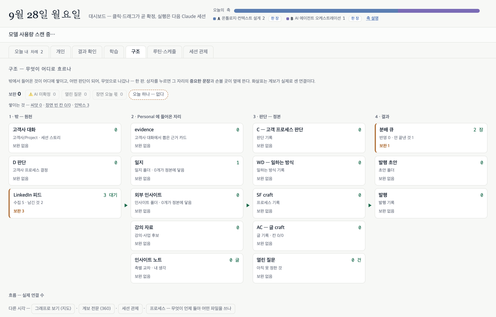

# 개인 대시보드

수집한 글·일지·판단 기록을 한 화면에서 판별하고, 워커에 일을 넘기고, 결과를 정본에 반영하는 개인 대시보드입니다.

> 코드는 공개하지 않습니다. 개인 기록 파일의 형식에 강하게 묶여 있어 떼어 내면 돌지 않습니다. 구조와 설계 판단만 정리합니다. 화면 캡처는 더미 데이터로 띄운 사본입니다.

| 항목 | 내용 |
|:--|:--|
| 구분 | 개인 프로젝트 |
| 기간 | 2026.08 ~ 진행 중 |
| 역할 | 설계·구현·운영 (사용자 1인) |
| 스택 | Python 3.9 표준 라이브러리 서버(`http.server`·`fcntl`), 프레임워크 없는 단일 HTML/JS, jsonl 파일 큐, 구독형 `claude` CLI 워커, launchd, macOS 알림·Slack 봇 알림, Tailscale 폰 접속(PWA) |
| 상태 | 운영 중 |

## 맥락

글을 모으고, 요약하고, 일을 대신 해 주는 자동화는 계속 늘었습니다. 수집기가 피드를 모으고, 요약 작업이 요점을 뽑고, 워커가 지시를 받아 답을 씁니다. 그런데 무엇을 남기고 무엇을 버릴지, 어떤 문장이 내 판단인지 정하는 사람은 저 하나입니다.

그래서 원칙을 하나 세웠습니다. "전처리가 아무리 많아도 사용자가 판단하는 자리는 대시보드 화면 하나다." 자동화가 몇 개든 결과는 이 화면으로 모이고, 판단은 이 화면에서만 합니다.

## 제약

- 서버는 모델을 부르지 않습니다. 모델이 필요한 일은 서버 밖 워커 프로세스로 띄우기만 합니다.
- 종량제 API 키를 쓰지 않습니다. 이미 결제 중인 구독 CLI 범위 안에서만 워커를 돌립니다.
- 무인 실행(launchd)은 수집·추출·알림처럼 결과를 기계적으로 판정할 수 있는 일만 맡깁니다. 판별과 정본 수정은 무인으로 돌리지 않습니다.
- 개인 데이터는 로컬 맥에만 둡니다. 폰은 사설망(Tailscale)으로만 붙습니다.

## 시스템 흐름

번호 순서대로 읽습니다. 무인 수집기(①)가 쌓은 수집 피드(②)를 서버(③)가 읽어 화면(④)에 보입니다. 사용자가 화면에서 판별하고 지시하면 서버가 작업 큐(⑤)에 카드를 적습니다. 서버 밖 워커(⑥)가 큐에서 카드를 집어 결과를 다시 큐에 쓰고, 알림(⑦)으로 그 카드를 가리킵니다. 사용자가 제출한 문장만 서버가 그대로 일지·판단 기록(⑧)에 반영합니다. 빨간 점선은 모델 호출 경계입니다. 서버는 이 선을 넘어 모델을 부르지 않고, 워커를 별도 프로세스로 띄우기만 합니다.

## 화면 구성

| 자리 | 하는 일 |
|:--|:--|
| 오늘 | 수집 글을 읽고 보관·버림을 정합니다. 글을 읽기 판에 끌어 놓으면 요점과 원문이 나란히 뜹니다. 맨 아래 "진행 중"에 내 차례인 카드가 모입니다. |
| 개인 | 글쓰기, 반응 태깅, 일정 같은 개인 흐름을 하위 탭으로 나눠 둡니다. |
| 구조 | 원천 → 들어온 자리 → 판단 기록 → 결과의 흐름을 한 판에 보입니다. 상자를 펼치면 그 자리의 문장과 비어 있는 칸이 뜨고, 그 자리에서 답합니다. |
| 세션 관제 | 지금 도는 워커가 무엇을 읽고 찾는지 사람 말 한 줄로 보입니다. 원문을 켜면 모델 문장과 도구 호출이 시간순으로 나옵니다. |
| 루틴·스케줄 | 무인 수집 작업의 마지막 실행과 실패를 보입니다. |
| 지도 · 360 | 파일 단위 지도와, 판단 기록 사이의 계보를 따로 봅니다. |

카드 하나는 이렇게 흐릅니다.

1. 수집 글이나 판단 기록 칸에서 지시를 적으면 카드가 생기고 워커가 바로 돕니다.
2. 답이 오면 같은 카드의 답 칸에서 이어 묻습니다. 맥락이 이어지면 새 카드를 만들지 않습니다.
3. [완료]를 누르면 반영할 문장의 미리보기가 뜹니다. 어디에 들어갈지도 먼저 보입니다.
4. 사람이 고쳐서 [제출]하면 그 문장이 그대로 판단 기록에 들어갑니다. AI 초안을 한 글자도 안 고쳤으면 AI 표기가 붙습니다.

## 변천

한 번에 설계하지 않았습니다. 쓰다가 걸린 자리를 그날 고쳤습니다.

### 2026-08-26 · 판별대

처음 이름은 판별대였습니다. 수집 글을 카드로 받고, 요약(브리핑)을 붙이고, 결과에서 대화를 이어 가고, 정본에 반영했는지 표시하는 판을 하루 이틀에 몰아서 만들었습니다. 이튿날 서버와 워커 둘이 같은 큐 파일을 각자 통째로 덮어쓰는 구멍을 발견하고, 큐의 쓰기 자리를 하나로 모았습니다.

### 2026-09-07 · 끊겨도 결과가 오고, 폰에서도 보이는 판

시킨 일 두 건이 6일째 "안 돌았다"에 머물러 있었습니다. 제가 다시 눌러야만 도는 구조였습니다. "안돌았으면 이어서 진행하고 보완해서 끊겨도 알아서 돌아서 결과 나오게 해줘." 서버가 90초마다 멈춘 카드를 찾아 최대 3회까지 다시 띄우게 했고, 형식만 틀린 답은 같은 세션에서 고쳐 받게 했습니다. 같은 날 폰에서도 판을 보게 했습니다("앱으로 만들어서 핸드폰에도 동기화되게 하면 좀 더 효율적일거같은데"). 알림을 누르면 그 카드로 바로 갑니다.

### 2026-09-17 · 질문은 쌓인 데이터를 읽은 뒤에만

카드가 물은 질문의 답이 이미 일지와 프로젝트 문서에 있었습니다. "그 데이터를 보고 질문을 해야지." 이번이 두 번째 지적이었습니다. 질문을 만드는 자리는 다섯 곳이었고 전부 같은 구멍이 있었습니다. 재료를 앞부분만 잘라 읽고, 프로젝트 폴더는 열지 않고, 이미 채운 칸 값을 넘기지 않았습니다. 이제 질문을 만드는 모든 자리가 묻기 전에 일지·판단 기록·이전 대화·프로젝트 문서를 먼저 읽고, 답이 있으면 확인만 합니다.

같은 날 마감 방식도 바꿨습니다. 채팅 원문을 그대로 박는 원칙은 출처는 지켰지만 쓸 만한 문장을 남기지 못했습니다("쓸만한 문장자체가 안쌓이니까"). 판단은 제 것이고, 문장은 AI가 다듬어도 된다고 정했습니다. 그래서 [완료]를 누르면 미리보기가 뜨고, 고쳐서 [제출]하는 흐름이 됐습니다.

### 2026-09-18 · 그 자리에서 고치기, 그리고 감시 세 겹

미리 써 준 문장에서 한 단어가 걸렸는데, 고치려면 "아니다"를 눌러 통째로 다시 쓰게 해야 했습니다. "너가 정리한 글들을 내가 인라인으로 편집이 가능했으면 좋겠어." 읽는 자리와 고치는 자리를 나누면 사람은 결국 통째로 다시 만들게 됩니다. 그래서 미리 쓴 문장은 본문처럼 보이다가 손대면 입력 칸이 되게 했습니다.

같은 날 요약 화면이 하루 종일 열리지 않았습니다. 문법 검사, 저장 훅, 테스트 19개가 모두 통과했는데 실제 요청 하나는 매번 죽었습니다. 저장 훅이 재시작 뒤 첫 화면 하나만 확인했기 때문입니다. 서버 로그에는 오류가 다 남아 있었지만 아무도 읽지 않았습니다. "하나 수정하면 다른쪽이 에러나고 하니까 그래서 감시 하고 검증해서 오류를 방지하는 작업이 필요할거같거든?" 감시를 세 겹으로 붙였습니다. 저장할 때 화면 갈래 아홉 개를 실제로 호출해 보고, 함수 안에서 이름이 가려지는 코드를 반려하고, 서버가 죽으면 판 위에 띠로 띄웁니다.

### 2026-09-22 · 보는 자리를 하나 줄이기

"시킨 것" 탭에 카드 하나가 5일째 "초안 만드는 중"이었습니다. 워커가 결과도 실패도 남기지 않고 죽으면 그 표시를 지우는 코드가 없었습니다. 이제 15분 넘게 소식이 없으면 서버가 "끊겼다"로 닫습니다. 그리고 그 탭 자체를 없앴습니다("탭을 넘어가기 귀찮아"). 대화가 읽기 판·글쓰기·구조 서랍에서 각자 일어나 판단 기록으로 닫히게 되자, 그 탭에는 자리 없는 카드만 남았기 때문입니다. 남은 카드는 오늘 탭 맨 아래 "진행 중" 한 줄로 옮겼습니다.

## 설계 판단

- **서버는 모델을 부르지 않습니다.** 판단은 사람이 하고, 모델은 서버 밖 워커에서 돕니다. 서버가 하는 일은 파일을 읽고, 카드를 적고, 워커를 띄우고, 사람이 제출한 문장을 그대로 넣는 것뿐입니다. 서버가 문장을 만들거나 고치지 않으므로, 판단 기록에 들어간 문장이 누구의 것인지 항상 가려집니다. 대가도 있습니다. 모델이 한 번 더 보면 좋을 자리에서도 서버는 기다립니다.
- **화면은 사람이 편한 쪽으로 짭니다.** 문법·특수어·단축키를 외워야 하는 설계는 탈락입니다. 카드는 "지금 묻는 것 → 바로 아래 답 칸 → 나머지 접힘" 순서입니다. 시스템이 쓴 글을 어디로 보낼지는 먼저 보여 주고, 사람이 고칩니다. 내부 개념어는 화면에 쓰지 않고 무슨 일이 일어나는지를 사람 말로 씁니다. 실제로 0번 눌린 버튼은 지웁니다.
- **로그는 감시가 아닙니다.** 기록이 남는 것과 누가 보는 것은 다릅니다. 검사가 통과했다는 것도 근거가 아닙니다. 사람이 실제로 쓰는 갈래를 직접 호출해 보고, 죽은 횟수는 로그 파일이 아니라 판 위에 띄웁니다. "도는 중" 표시를 적는 코드를 만들면 그 표시를 지우는 감시도 같이 만듭니다.
- **질문은 쌓인 데이터를 읽은 뒤에만 합니다.** 같은 답을 두 번 입력하게 만드는 질문은 실패입니다. 묻기 전에 관련 기록을 먼저 읽고, 답이 있으면 "여기 이렇게 적혀 있다 — 맞나"로 확인만 합니다. 빈자리만 묻습니다.

## 적용한 개념

구현에 쓰인 자료구조·알고리즘 개념입니다.

- **파일 잠금과 원자 교체** — 작업 큐는 jsonl 파일 하나이고, 서버와 워커 여러 개가 동시에 씁니다. 모든 쓰기는 한 모듈을 거칩니다. 배타 잠금(`flock`)을 잡고 다시 읽은 뒤, 같은 디렉터리에 임시 파일로 다 쓰고 `fsync` 후 `os.replace`로 바꿔 끼웁니다. 교체가 원자적이라 읽는 쪽은 잠금 없이도 항상 온전한 파일을 봅니다. 검사 후 거절할 때는 저장하지 않는 표식을 돌려줘 파일을 건드리지 않습니다.
- **상태 머신** — 카드는 대기 → 정리됨 → 도는 중 → 끝남·취소로 넘어갑니다. 마감에도 별도 상태가 있습니다. 초안을 만드는 중, 제출 대기, 반영됨 순서입니다. 화면과 감시 루프는 같은 상태 판정을 씁니다.
- **하트비트와 감시 루프** — 워커는 실행마다 pid와 진행 줄을 하트비트 파일에 남깁니다. 서버의 감시 루프는 90초마다 상태를 확인합니다. 도는 중이라 적혔는데 프로세스가 죽은 카드와, 지시는 있는데 실행 기록이 없는 카드를 다시 띄웁니다. 마지막 시작 뒤 3분은 쉬고, 한 카드에 최대 3회까지만 다시 띄웁니다. 15분 넘게 소식이 없는 마감 턴은 닫습니다.
- **그래프 파싱** — 판단 기록·일지·발행 기록에서 서로를 가리키는 인용을 결정적 파싱으로 읽어 노드와 엣지를 만들고, 한 판단이 어디까지 흘러갔는지 하류를 계산합니다. 모델을 쓰지 않으므로 같은 파일이면 항상 같은 계보가 나옵니다.
- **정규화 부분일치** — "내 문장만 골라 넣기" 마감에서 워커가 고른 문장이 실제로 제가 친 문장인지 서버가 다시 확인합니다. 공백·부호를 정규화한 뒤 원문 부분일치로 대조하고, 질문을 되받아 쓴 문장은 뺍니다. 모델의 말을 믿지 않고 문자열로 확인합니다.

## 이 저장소에 없는 것

- 소스 코드를 뺐습니다. 개인 기록 파일의 형식에 묶여 있어 그대로는 재사용할 수 없습니다.
- 개인 데이터(수집 글, 일지, 판단 기록, 대화 기록)를 뺐습니다.
- 실제 화면을 뺐습니다. 캡처는 빈 가짜 홈 디렉터리에 더미 데이터를 넣고 띄운 사본이며, 개인 파일명과 고객사가 드러나는 고정 문구는 일반 레이블로 바꿨습니다.
